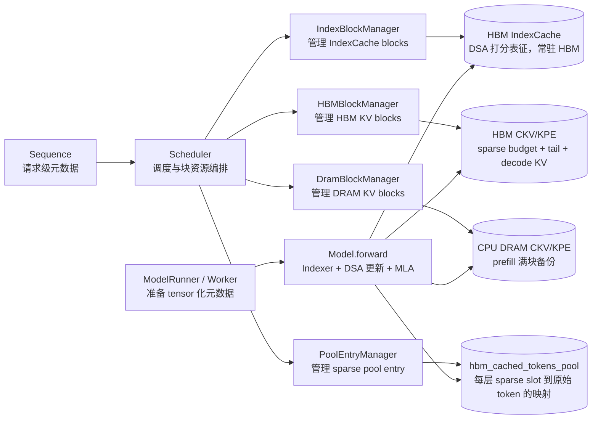
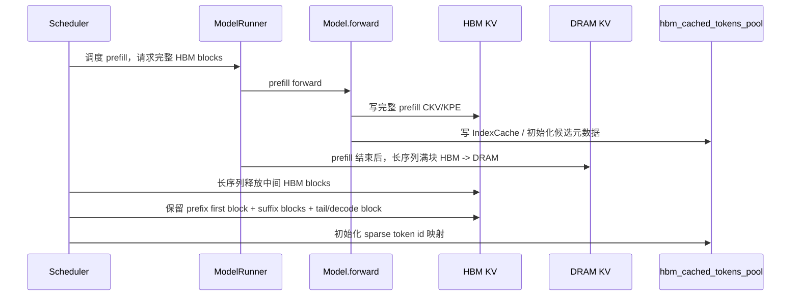
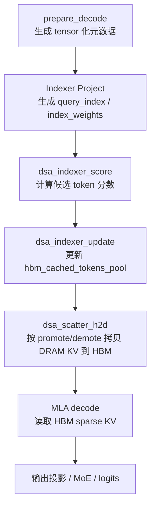

# Decode 阶段 DSA KVcache 卸载设计文档

本文档描述 `nano-vllm-ascend-DeepSeekV32` 中 decode 阶段 DSA KVcache 卸载机制的稳定设计。

设计目标是在长序列请求进入 decode 后，将 prefill 阶段的大部分 CKV/KPE 从 NPU HBM 卸载到 CPU DRAM，只在 HBM 中保留一份较小的 sparse budget、prefill 尾块以及 decode 新产生的 KVcache。这样可以显著降低单请求 HBM 占用，提高 decode batch size，并尽量把 TPOT 增量收敛到少数几个 DSA 相关算子中。

本文只描述当前收敛后的方案和关键优化方向，不展开每个算子的底层实现细节。尾部附录保留早期设计提纲和讨论记录，作为历史参考，不作为当前实现的唯一依据。



## 1. 目标和边界

### 1.1 目标

1. 长序列 prefill 结束后，将 prefill 满块的 CKV/KPE 保存到 CPU DRAM。
2. decode 阶段只让一部分 prefill 历史 layer_kv_token 常驻 HBM，并允许每层动态更新。
3. decode 阶段新产生的 KVcache 始终放在 HBM，不参与卸载。
4. IndexCache 常驻 HBM，用于每层 DSA 打分。
5. model.forward 需要的调度元数据尽量在 forward 前 tensor 化，避免热路径中出现细碎 H2D/D2H。
6. decode 热路径必须支持 batch，核心逻辑不能依赖逐请求 Python 循环。
7. 性能目标是：卸载行为正确时，除 DSA 三大算子和 indexer_project 外，其余 decode 热路径尽量与不卸载 baseline 对齐。

### 1.2 边界

1. 本方案使用 MLA 计算 HBM sparse KV，不走 SFA decode。
2. 当前实现不做 DRAM/IndexCache 前缀复用；设计上可扩展到前缀复用。
3. 当前主路径采用固定 `Tx=128` 的有损更新策略；接口保留 `copy_counts`，后续可扩展到动态 `Tx` 或无损策略。
4. 当前所有 TP rank 冗余执行 DSA 更新。后续可考虑 rank0 计算后广播，但这不是当前主路径。

## 2. 核心概念

### 2.1 layer_kv_token

本文中的 token 若无特别说明，均指 `layer_kv_token`：即某一层中某个序列位置对应的一份 CKV/KPE 表征。DSA sparse budget 管理的是 prefill 满块中的 layer_kv_token。

### 2.2 三类 cache

| cache | 典型形状 | device | 作用 |
|---|---:|---|---|
| `index_cache` | `(L, Cidx, B, 1, 128)` | NPU | DSA indexer 的 K 表征，常驻 HBM |
| `hbm_ckv_cache` | `(L, Chbm, B, 1, 512)` | NPU | MLA latent KV，decode 直接读取 |
| `hbm_kpe_cache` | `(L, Chbm, B, 1, 64)` | NPU | MLA RoPE K，decode 直接读取 |
| `dram_ckv_cache` | `(L, Cdram, B, 1, 512)` | CPU | prefill 满块 CKV 备份 |
| `dram_kpe_cache` | `(L, Cdram, B, 1, 64)` | CPU | prefill 满块 KPE 备份 |

`L` 为层数，DeepSeek V3.2 通常为 61；`B` 为 block size，当前常用 128。

DRAM KV 使用可被 NPU 算子访问的 host-mapped/pinned 内存。`dsa_scatter_h2d` 负责从 DRAM KV 按 token 粒度搬回 HBM sparse slot。

### 2.3 三套 block_table

每个请求维护三套 block table：

| block table | 指向 | 语义 |
|---|---|---|
| `index_block_table` | HBM IndexCache blocks | 原始序列语义，用于 DSA 打分 |
| `hbm_block_table` | HBM CKV/KPE blocks | decode 阶段的 sparse KV 语义，用于 MLA 和 scatter 目的地址 |
| `dram_block_table` | DRAM CKV/KPE blocks | 原始 prefill 满块语义，用于 scatter 源地址 |

三套 block table 都是请求级元数据，不按层拆分。不同层 sparse budget 选中的原始 token id 可能不同，这个逐层差异由 `hbm_cached_tokens_pool[layer, pool_entry, slot]` 表达。

block id `0` 作为 null block / padding，不承载真实 KV；真实 block 从 `1` 开始编号。

### 2.4 hbm_cached_tokens_pool

`hbm_cached_tokens_pool` 的形状为：

```text
Tensor[(L, pool_capacity, max_sparse_tokens), int32, npu]
```

其中：

- `L`：模型层数。
- `pool_capacity`：可同时 decode 的请求数，固定等于 `max_num_decode_seqs_per_step`。
- `max_sparse_tokens`：按 sparse budget 分段函数可计算出的最大 HBM prefill token 预算。

`hbm_cached_tokens_pool[layer, pool_entry, slot]` 表示某层、某请求的第 `slot` 个 HBM sparse token 对应的原始 prefill token id。

## 3. 长度和 sparse budget

### 3.1 符号

| 符号 | 含义 |
|---|---|
| `Sp` | 请求 prefill token 数 |
| `B` | block size |
| `Nfull = Sp // B` | prefill 阶段完整 block 数 |
| `tail_len = Sp % B` | prefill 最后一个非满块 token 数 |
| `Ns` | HBM sparse budget 保留的完整 block 数 |
| `Ts = Ns * B` | HBM sparse budget token 数 |
| `Sd` | 已经写入 KVcache、会参与本次 MLA 的 decode token 数 |
| `Tx` | 每层每步最多换入的 token 数 |

MLA decode 阶段的实际 KV 长度为：

```text
actual_seq_lengths_kv = Ts + tail_len + Sd
```

注意这里不是原始序列长度，而是 HBM sparse KV 视角下的实际参与 attention 的 token 数。

### 3.2 sparse budget 分段函数

当前按 prefill 满块数 `Nfull` 计算保留块数 `Ns`：

| 条件 | `Ns` |
|---|---:|
| `Nfull < 64` | `Nfull`，不触发卸载 |
| `64 <= Nfull < 128` | `ceil(0.30 * Nfull)` |
| `128 <= Nfull < 256` | `ceil(0.25 * Nfull)` |
| `256 <= Nfull < 512` | `ceil(0.22 * Nfull)` |
| `512 <= Nfull` | `ceil(0.20 * Nfull)` |

按当前配置可假设 `Ts >= 2048`。例如 `64 <= Nfull < 128` 时，`Ns >= ceil(64 * 0.30) = 20`，若 `B=128`，则 `Ts >= 2560`。

## 4. Prefill 结束后的卸载

当前实现把 prefill attention 和 prefill 后卸载分开：prefill 本身仍对完整 KVcache 计算 MLA；prefill 结束后，再重写 HBM block table 并完成 DRAM 备份。



### 4.1 短序列

短序列指不会触发 decode 卸载的序列。短序列保持 baseline 语义：

1. 不拷贝到 DRAM。
2. 不重建 HBM sparse KV。
3. `hbm_cached_tokens_pool[b]` 写成 dense arange，与原始 token 顺序一致。
4. `hbm_block_table` 仍指向原始 HBM KV blocks。

### 4.2 长序列

长序列指会触发 decode 卸载的序列。prefill 结束后：

1. 将 full prefill 满块 CKV/KPE 从 HBM 拷贝到 DRAM。
2. 调度侧释放中间 HBM blocks，只保留 prefix first block 和若干 suffix blocks。
3. 不再执行 DRAM -> HBM 的初始化搬回，因为保留下来的 HBM blocks 本身已经包含 prefix/suffix KV。
4. `hbm_cached_tokens_pool` 初始化为：

```text
[0, 1, ..., B-1] + [candidate_len - suffix_tokens, ..., candidate_len - 1]
```

这里的 prefix 是 first block，而不是固定 128 token；如果 `B=256`，则保留 prefix 256 token。

当前 prefix first block 只作为初始化保留，不永久 pin 住。后续 DSA 更新可以淘汰 prefix slot；如果未来要永久保护 attention sink token，只需要在 `dsa_indexer_update` 算子内部禁止 demote 对应 slot，外层接口不需要变化。

## 5. Decode 阶段流程



`prepare_decode()` 在 model.forward 前准备以下关键元数据：

| 元数据 | 作用 |
|---|---|
| `hbm_block_tables` | MLA 和 scatter 的 HBM 目的 block table |
| `dram_block_tables` | scatter 的 DRAM 源 block table |
| `index_block_tables` | DSA score 的 IndexCache block table |
| `slot_mapping` | decode 新 token 写入 HBM 的位置 |
| `actual_seq_lengths_kv` | MLA 实际读取的 sparse KV 长度 |
| `candidate_lens` | 每个请求可参与 DSA 选择的 prefill token 数 |
| `selected_lens` | 每个请求当前 HBM sparse budget token 数 |
| `req_pool_entries` | batch 中请求到 sparse pool entry 的映射 |

每层 decode 的 DSA 更新逻辑为：

1. `indexer_project` 计算当前 decode query 对应的 DSA query 表征。
2. `dsa_indexer_score` 使用 query 表征、IndexCache 和 `index_block_table` 计算候选 token score。
3. `dsa_indexer_update` 根据 score 选择 promote token 和 demote slot，并更新 `hbm_cached_tokens_pool`。
4. `dsa_scatter_h2d` 根据 promote/demote 结果，把 DRAM 中的 CKV/KPE 搬到 HBM sparse slot。
5. MLA 使用更新后的 HBM sparse KV 计算 decode attention。

若 `Tx == 0`，则跳过 `dsa_indexer_score`、`dsa_indexer_update` 和 `dsa_scatter_h2d`，只使用 prefill 结束时初始化好的 prefix first block + suffix sparse KV。

## 6. 算子接口

### 6.1 dsa_indexer_score

功能：根据当前 decode query 的 indexer 表征和历史 IndexCache，计算每个候选 layer_kv_token 的 DSA 分数。

核心输入包括：

- `query_index`: 当前 decode query 的 indexer Q 表征。
- `index_weights`: 当前 decode query 的 indexer weights。
- `index_cache`: 历史 token 的 indexer K 表征。
- `index_block_table`: 原始序列语义的 IndexCache block table。
- `candidate_lens`: 每个请求的候选 token 数。
- `score_out`: 输出分数，当前固定 bf16。

当前实现固定走 bf16-out 新路径，避免旧路径中额外的 fp32 输出和 copy。score tensor 只需要覆盖有效候选区域，后续 `dsa_indexer_update` 按 `candidate_lens` 读取。

### 6.2 dsa_indexer_update

功能：只更新 sparse 索引，不做实际 KV 搬移。

接口语义：

```text
输入/输出：score_out, hbm_cached_tokens_pool
输出：promote_idx, demote_idx, copy_counts
输入：candidate_lens, selected_lens, req_pool_entries, max_copy_tokens
```

其中：

- `promote_idx[b, i]` 是原始 token id，指向 DRAM 中的 prefill token。
- `demote_idx[b, i]` 是 HBM sparse budget 内的 slot id。
- `copy_counts[b]` 是该请求本步实际需要换入的 token 数。固定有损策略下通常等于 `Tx`；未来无损或动态策略下可以小于 `Tx`。

需要满足的硬约束：

1. `promote_idx[b, :copy_counts[b]]` 内部 unique。
2. `demote_idx[b, :copy_counts[b]]` 内部 unique。
3. 更新后的 `hbm_cached_tokens_pool[layer, entry, :selected_len]` 内部 unique。
4. 更新后满足：`hbm_cached_tokens_pool[layer, entry, demote_idx] = promote_idx`。

当前默认使用 CANN 真算子；torch 伪算子保留为调试路径。若用户显式选择真算子但算子调用失败，应直接报错，不做 silent fallback。

### 6.3 dsa_scatter_h2d

功能：根据 `promote_idx` 和 `demote_idx`，把 DRAM 中的 CKV/KPE 拷贝到 HBM sparse slot。

核心输入：

- `promote_idx`: 原始 token id。
- `demote_idx`: HBM sparse slot id。
- `copy_counts`: 每请求实际 copy 数。
- `hbm_block_table`: HBM 目的 block table。
- `dram_block_table`: DRAM 源 block table。
- `hbm_ckv_cache / hbm_kpe_cache`: 目的 cache。
- `dram_ckv_cache / dram_kpe_cache`: 源 cache。

`dsa_scatter_h2d` 在当前 NPU stream 上提交拷贝任务。性能路径不在 scatter 后做全 device synchronize；如果需要正确性诊断，可通过 `NANOVLLM_DSA_CHECK=1` 打开校验。

## 7. Indexer Project

`indexer_project` 负责计算 DSA 打分所需的 query 侧表征。它和 `dsa_indexer_score` 的关系是：

```text
hidden_states / q_c  --indexer_project-->  query_index, index_weights
query_index, index_weights, index_cache  --dsa_indexer_score--> score_out
```

decode 后续 step 主要走 query-only 路径：历史 token 的 IndexCache 已在 prefill 或 decode 写入，不需要每步重复计算 K。当前优化方向包括：

1. query-only 输出 buffer 复用，减少临时 tensor 分配。
2. `weights_proj` 固定 BF16 路径，避免 decode 热路径中不必要的 fp32 投影。
3. 小 batch 下尝试 TorchAir 组图，降低 Python 调度和小算子开销。
4. q BMM 路径按 batch 上限选择，避免大 batch 时误走低效路径。
5. 长期可考虑把 query-only indexer_project 做成融合 CANN 算子。

这些是性能优化方向，文档不展开底层实现细节。

## 8. 调度和容量配置

当前块数量直接由环境变量决定，不再通过 warmup 反推：

| 配置 | 含义 | 默认 |
|---|---|---:|
| `NANOVLLM_HBM_NUM_BLOCKS` | HBM CKV/KPE block 数 | 必填 |
| `NANOVLLM_DRAM_NUM_BLOCKS` | DRAM CKV/KPE block 数，同时也是 IndexCache block 数 | 必填 |
| `NANOVLLM_MAX_MODEL_LEN` | 最大序列长度 | 65536 |
| `NANOVLLM_MAX_PREFILL_SEQS_PER_STEP` | 单步最多调度多少个 prefill 请求 | 1 |
| `NANOVLLM_MAX_DECODE_SEQS_PER_STEP` | decode batch 上限，也是 sparse pool capacity | 256 |
| `NANOVLLM_DSA_OFFLOAD_FIXED_TX` | 固定有损更新的 `Tx` | 128 |

调度器保持如下规则：

1. `running` 队列长度不超过 `max_num_decode_seqs_per_step`。
2. 当 `running` 未满时，优先调度 prefill。
3. 当 `running` 已满时，即使 waiting 队列还有请求，也优先调度 decode。
4. `dsa_offload_pool_capacity = max_num_decode_seqs_per_step`，不再单独配置。

## 9. 正确性不变量

为了保证 sparse KV 和 MLA 语义一致，需要持续满足：

1. `hbm_block_table`、`actual_seq_lengths_kv`、`slot_mapping` 必须使用同一套 sparse KV 语义。
2. `index_block_table` 始终使用原始序列语义。
3. `dram_block_table` 只覆盖 prefill 满块，使用原始 prefill 满块 token id 语义。
4. `hbm_cached_tokens_pool` 中有效区域的 token id 必须落在 `[0, candidate_len)`。
5. 对长序列，每层 `hbm_cached_tokens_pool` 允许不同；三套 block table 不按层拆。
6. scatter 后，使用 `hbm_cached_tokens_pool` 作为索引从 DRAM 取出的 CKV/KPE，应与 HBM sparse slot 中的数据一致。
7. 若 `NANOVLLM_DSA_CHECK=1`，只做诊断校验；若为 `0`，性能路径不应引入校验同步。

## 10. 性能观察和优化方向

当前 decode TPOT 的主要优化目标集中在：

1. `dsa_indexer_score`
2. `dsa_indexer_update`
3. `dsa_scatter_h2d`
4. query-only `indexer_project`

其它热路径应尽量与不卸载 baseline 对齐。已经固化的方向包括：

- decode MLA 使用 FIA v2 路径。
- RoPE cache 使用 neox 语义，与 MLAPO 对齐。
- qkv_a 投影固定 fused。
- `kv_b_proj` 加载后释放，只保留 MLA 所需的投影权重。
- `dsa_indexer_score` 固定写 bf16 `score_out`，减少额外 copy。
- scatter 后不在性能路径做全 device synchronize。

后续可继续优化：

- `dsa_indexer_update` 算子内部 topk 和唯一性维护。
- query-only indexer_project 的组图或融合算子版本。
- `dsa_scatter_h2d` 的 AIV 并行搬运效率。
- 大 batch 下 q_up/v_up 相关 BMM 路径。
- 动态 `Tx` 或无损更新策略。

## 11. 后续扩展

### 11.1 动态 Tx / 无损策略

当前接口已经有 `copy_counts`，因此未来可以在不改变外层框架接口的情况下，把 `dsa_indexer_update` 改成动态 `Tx`：

- 若 `GT2048` 已全部在 HBM sparse budget 中，则 `copy_counts[b]=0`。
- 若有缺失，则 promote 缺失部分，并 demote 同等数量低分 token。

这主要改变 `dsa_indexer_update` 内部策略和 `dsa_scatter_h2d` 的实际 copy 数量，不需要重写调度元数据。

### 11.2 前缀复用

前缀复用主要发生在 `DramBlockManager` 和 `IndexBlockManager`：

```text
Nc = min(DramBlockManager 命中块数, IndexBlockManager 命中块数)
```

HBM sparse budget 本身不直接表达前缀命中。命中前缀块可在 prefill 前加载到 HBM 参与完整 prefill attention，prefill 结束后再按普通规则释放。

### 11.3 prefix 保护

当前 prefix first block 只作为初始化保留，不永久 pin 住。若未来希望永久保护 attention sink token，可在 `dsa_indexer_update` 内部禁止 demote prefix slot，外层 block table、pool 和 scatter 接口不需要变化。

## 附录：设计文档提纲（提示词）

````
摘要：
借助 deepseek v32 的稀疏 attention 机制（Deepseek sparse attention, DSA），在 decode 阶段做 KVcache-offloading ，在 prefill 结束时将大部分 KVcache 卸载到 CPU DRAM 上，这样一个请求一旦进入 decode，大部分 HBM KVcache就会被释放，从而降低显存占用，在显存有限的情况下提升 decode batch-size 。
此外，这项技术最关键的就是要在 HBM 上（也就是这个请求的大部分显存块被释放后，这个请求剩余的 KVcache HBM 块内）维护一些热的 KVcache tokens 作为缓存，并在每个 decode step 动态召回一部分当前急需的 KVcache tokens ，并淘汰另一部分分数最低的 KVcache tokens 。


概念说明：
0. DSA : deepseek sparse attention 
1. KVcache : deepseekv32 是把原本的 KVcache 压缩成 kpe cache 和 ckv cache (也叫 nope cache) 。所以本文之后提到 KVcache 是指 kpe cache + ckv cache 的统称。 它们的 shape 应该是 .....
2. Indexcache : 是指 deepseek v3.2 的 indexer 对应的 k 表征 。 Indexcache = [(L, Cidx, B=128, 1, head_dim=128), bf16, npu]
3. layer_kv_token : 一层的1个token对应的KVcache
4. ground_truth 2048 : 是指 DSA 在某一decode step的某一层选中的 2048 个 token 。简称 GT2048 。如果 GT2048 全部参与了 attention 计算，我们就认为推理是无损的。如果无法保证 GT2048 全都参与 attention 计算，则认为推理是有损的。
5. 文档约定使用 tensor[shape, dtype, device=cpu/npu] 这种形式来描述一个tensor
6......


符号说明： 
0. 模型相关
    L = 61 : 模型层数
1. nanovllm引擎相关：
    Cidx  : HBM 上 Indexcache 的物理块数量。也即 IndexBlockManager 管理的物理块数量
    Chbm  : HBM 上 KVcache 的物理块数量。也即 HBMBlockManager 管理的物理块数量
    Cdram : DRAM 上 KVcache 的物理块数量。也即 DramBlockManager 管理的物理块数量
    max_decode_batch : 一次调度允许的最大 decode batch-size
    max_model_len : 模型最大支持的序列长度。理论上是模型参数，但实际上nanovllm引擎可以设置，所以算引擎参数。
2. 每次decode 调度相关：
    bs : decode batch size ，也就是一次 decode llm.step() 的并发处理的请求数
3. 站在一个请求的角度：
    3.1  B  : nano-vLLM KVcache block size (典型 B=128)
    3.2  Sp : 请求的 prefill 序列长度 (tokens)
    3.3  Sd : 请求的 当前已经 decode 的 token 数量。 prefill阶段 Sd=0, 第一步decode时 Sd=1，第2步decode时 Sd=2
    3.4  Np : 请求的 prefill 需要的整块的数量， Np = Sp / B (向下取整)
    3.5  Nr : 请求的 prefill 末尾非满块需要的块数， Nr=(Sp+B-1)/B -  Np ，只可能取 0 或者 1。如果 Sp 刚好能整除 b ，则 r=0 ，如果 Sp 不能整除 b ，则 r=1
    3.6  Nd : 请求的 prefill 末尾非满块以及 decode 新产生的 token 所需的块数量。 Nd = (Sp+Sd+B-1)/B - Np
    3.7  Nc : 请求的 Np中命中 DRAM 的块数（前缀缓存）
    3.8  (Np-Nc) : 请求的 未命中 DRAM 的块数（非前缀缓存）
    3.9  Ns : 请求的 HBM sparse budget block count ，请求原本有 Np 个 prefill 块，在 prefill 结束后，针对 prefill 块保留 Ns 个块，用来作为 HBM sparse budget blocks 。而 Np 个块则全部被卸载到 DRAM 。因此，HBM上一共有 Ns*B 个稀疏token预算。后续的稀疏都是从 DRAM 上的 Np*B 个 token 中挑选重要的 token 加载到 Ns 个块中，同时淘汰 Ns 个块中不重要的 token 。
    3.10 Tp=Np*B : 从DRAM上参与稀疏候选的 layer_kv_token 的数量
    3.11 Ts=Ns*B : 在HBM上存放的被缓存的 layer_kv_token 的数量（或者叫token数量预算更合适）。必然有 Ns ≤ Np
    3.12 Tx   : 该请求每个 decode step 的每一层，从 DRAM 加载到 HBM 的 token 数量。可能每步每层都不一样，也可能一样。取决于具体采用什么算法。


零、背景、deepseek v3.2 的 DSA (deepseek sparse attention) 机制：
    1. 背景：简要介绍一下 DSA
    2. 机遇和挑战：长序列下，每个请求占较大的显存，导致decode batch-size首先，GPU/NPU算力用不满，导致算力浪费，TPS远不如短序列decode。


一、DSA稀疏卸载算法设计：
    本节只描述算法，不涉及框架方案，先给读者一个overview。我们使用一种 "动态缓存更新" 的方法来进行 DSA 卸载。算法流程如下：
    1. 在prefill结束后，卸载全部的 KVcache （也即Np*）到 DRAM 。同时，在 prefill 进行到各层时，使用 prefill 阶段的 indexer 挑选重要的 top Ts 个 layer_kv_token 加载到 HBM 上。
    2. 在每个decode step的每一层： 
       2.1 token分数计算：先使用 indexer 机制，对每个 token 打分，得到 score 
       2.2 缓存更新算法：在 HBM 上已有的 Ts 个 token 中，挑选 Tx 个不重要的（称为 demote tokens）。再在 DRAM 上挑选 Tx 个重要的（称为 promote tokens），把重要的 token 加载来，覆盖掉不重要的。具体有2种算法：
           2.2.1 无损算法 （Tx不是固定值）： 
               - 对 score 求 top2048 得到 GT2048 ，
               - 求 Tx = GT2048 - Ts (求差集，这里写的不是很严谨) 作为 promote tokens 
               - 在 Ts - GT2048 差集中找出 bottom-Tx (最低Tx的分数) 作为 demote tokens 
               - 用 promote tokens 加载上来覆盖 demote tokens 。 
               - 最后，用 MLA 算子计算全部 HBM 上的 Ts 个 tokens 的 attention 。注意这里不是用 sparse_flash_attention (sfa) 而是 MLA ，是因为 Ts 个 token 在 HBM上反倒是 page 粒度存储的，可以用 MLA 。
               - 由于这种方法能保证 GT2048 全部参与 MLA ，因此被认为是无损。
           2.2.2 有损算法（Tx会是一个固定值，该固定值可调）： 
               - 对HBM 上的 Ts 个 token 按分数求 bottom-Tx ，作为 demote tokens 
               - 对 "HBM上没有，但是DRAM上已有" 的 Tp-Ts 个 tokens 按分数求 top-Tx ，作为 promote tokens 。
               - 用 promote tokens 加载上来覆盖 demote tokens 。 
               - 最后，用 MLA 算子计算全部 HBM 上的 Ts 个 tokens 的 attention 。同上。
           
       


二、框架方案overview （为了支持上述算法，设计了以下推理框架方案）
1. 站在请求角度：请求在 prefill 阶段，申请 Np+Nr 个 KVcache 块 ，……
2. 站在框架改造的角度，包括几大改造：
    1. 块管理器：将 nanovllm 原本的 1 个块管理器 (BlockManager) 拆分为3个，目的是使得它们能被独立申请和释放：
        1.1 IndexBlockManager (for IndexCache on HBM)，块数 = Cidx
        1.2 HBMBlockManager (for KVcache on HBM)，块数 = Chbm 
        1.3 DramBlockManager (for KVcache on DRAM) ，块数 = Cdram
         * 注意：应该让 Cidx 略大于 Cdram ，Cdram 远远大于 Chbm 。 应该加入一个 nanovllm 超参数来控制 Cdram / Chbm 的比值。
    2. Sequence对象（请求对象）：需要加入一些元数据成员变量：
        2.1 index_block_table, hbm_block_table, dram_block_table
        2.2 Np 等元数据，从而让 worker 能够知道
        2.3 需要加入 int 形元数据 hbm_cached_tokens_pool_entry
    3. Scheduler 调度器：
        3.1 当决定一个请求能否调度，原本只要看 BlockManager 是否能申请到，现在是要看 3 种 BlockManager 是否都能申请到。
        3.2 在prefill结束时要从 HBMBlockManager 中释放一部分 
        3.3 需要加入 HBMcachedTokensPoolEntryManager ，每个请求用它来申请 hbm_cached_tokens_pool_entry ，用来指向 hbm_cached_tokens_pool 中的一个槽位。请求结束时，需要释放 hbm_cached_tokens_pool_entry ，以便它能被其它请求使用。
    4. Worker (ModelRunner)：
        4.1 需要加入物理块 tensors: IndexCache、hbm_kvcache、cpu_kvcache
        4.2 需要加入 tensor: hbm_cached_tokens_pool = [(L, max_decode_batch, max_model_len), int32, npu], 该 tensor 用于记录各个请求的各层在当前的 decode step 缓存的 token 索引。（这也是我面的缓存更新算法的关键）。
             注意： hbm_cached_tokens_pool 是一个池子，一个请求 req 在其中会占用槽位 hbm_cached_tokens_pool[:, req.hbm_cached_tokens_pool_entry, :]
             * 之所以这里要把 hbm_cached_tokens_pool 做成 "槽位申请释放制" ，是因为 model.forward() 会更新 hbm_cached_tokens_pool , 下一个decode step 也要使用更新后的 hbm_cached_tokens_pool
        4.3 在 model.forward 开始前，需要额外 tensor 化一些东西，以便后续 model.forward 时能做到全算子化。
            当前所有组batch进行decode的请求的 req.hbm_cached_tokens_pool_entry 需要算子化成一个 tensor : req_pool_entries = [(bsz,), int32, npu]
    5. Worker内的模型forward流程（deepseek_v32.py）：
        5.3 需要加入3个算子：
            - dsa_indexer_score ：计算分数，相当于原本 npu_lightning_indexer 的前半部分算分数的部分
            - dsa_index_update ：缓存索引更新算子：挑选 promote 和 demote tokens 。其具体实现决定了是 2.2.1无损算法 还是 2.2.2有损算法 
            - dsa_scatter_h2d ：根据 dsa_index_update 的结果，执行实际的 H2D 搬移。


三、站在每个请求的角度讲，应该是以下流程：
1. prefill阶段：
    1.1 scheduler侧： 申请 (Np+Nr) 个 HBM blocks 和 Np 个 DRAM blocks 。并用哈希匹配前缀缓存命中，假设 Np 中有 Nc 个前缀块缓存命中。
    1.2 worker侧： 
        1.2.1 将 Nc 个命中的块从 DRAM 加载到 HBM (为了简单起见，不需要流水加载，在 model.forward 之前加载就行)
        1.2.2 运行 model.forward() ，将计算出的 (Np-Nc) 个未命中的 KVcache 块填入 HBM。此外，也要填入 Nr 这个非满块到 HBM 
              - 每层运行结束后，将 (Np-Nc) 个计算出的块从 HBM 卸载到 DRAM 。然后，挑选重要的 Ts=Ns*B 个 tokens ，放到 Np 个 HBM 块中的前 Ns 个块内。相当于初始化缓存
    1.3 scheduler侧： worker 工作结束后，释放大部分HBM块（被释放的块后面会允许其它请求占用），保留一小部分。关于保留的数量，是一个分段函数：
        情况1  Np<64, 不释放。相当于序列长度 <8192 时，不做 decode 卸载，Ns = Np
        情况2  64  ≤ Np < 128, Ns = Np * 0.30 (向上取整)
        情况3  128 ≤ Np < 256, Ns = Np * 0.25 (向上取整)
        情况4  256 ≤ Np < 512, Ns = Np * 0.22 (向上取整)
        情况5  512 ≤ Np      , Ns = Np * 0.20 (向上取整)
        实际上，以上参数 0.30, 0.25, 0.22, 0.20 都做成宏定义。
        注意：应该从每个请求的 block_table 的末尾开始释放，保留前面的 Ns 个块。因为之前 model.forward 中已经挑选了重要的 tokens 到前面 Ns 个块中。
2. decode阶段：
    2.1 scheduler侧： 如果一个请求的最后一个 KVcache 块满了，就从 IndexBlockManager 和 HBMBlockManager 申请新块。decode阶段的 KVcache 不参与卸载。
    2.2 worker侧： 
        - 每层运行 dsa_indexer_score、dsa_index_update、dsa_scatter_h2d 。
        - 然后在 Ns 个稀疏budget块和 Nd 个 decode tokens 上计算 MLA （注意这里用MLA而不是SFA）


四、块管理器详细设计：
1. 修改前：
   原本的 nano-vLLM 只有 BlockManager。对于 deepseekv32 模型来说，当请求进入 prefill 阶段时、或者 decode 攒满一个块时，需要从 BlockManager 中申请 HBM 块号，对于每个请求，会有一个 request.block_table ，也即它申请的块号。 request.block_table 共同管理 KVcache (KVcache包括了 kpe cache 和 nope cache 。以后说 KVcache 都是指 kpe cache + ) 和 IndexCache (IndexCache 是指 deepseek v3.2 的 indexer 对应的 k 表征）。此外，BlockManager 还能通过 hash 匹配，实现 GPU 上的前缀缓存复用（对于 deepseekv32 ，其实 KV）。
2. 修改后：需要将 BlockManager 解耦为三个 BlockManager
   2.1  IndexBlockManager : 管理 HBM 上的 IndexCache (包括prefill和decode阶段新产生的)。IndexCache 是不会卸载到 DRAM 的。允许 prefill 阶段的满块进行前缀复用，只有 prefill 阶段的满块会保留合法的 hash 。
   2.2  HBMBlockManager : 管理 HBM 上的 KVcache 。完全不允许任何前缀复用，因此完全不需要 hash 机制。
        2.2.1 当一个请求在prefill阶段，HBMBlockManager 管理该请求的 prefill 阶段的全量 KVcache 
        2.2.2 当一个请求在decode阶段， HBMBlockManager 管理该请求的 prefill 阶段的一部分 KVcache (token粒度打散)，以及 decode 阶段新产生的全部 KVcache . decode 阶段新产生的 KVcache 并不会卸载到 DRAM ，而是全部放在 HBM 上。
   2.3  DramBlockManager : 管理卸载到 DRAM 上的 KVcache 。只有 prefill 序列的满块会卸载到 DRAM ，且允许前缀复用，这些块都会保留hash。decode阶段 新产生的 KVcache 并不会卸载到 DRAM 。


五、 Sequence对象详细设计：


六、 Scheduler 详细设计：


七、 Worker 详细设计：


八、 模型forward流程详细设计：
     8.1 dsa_indexer_score 算子：（定义清楚算子接口，这里参照一下 npu_lightning_indexer ，与他唯一的不同在于 npu_lightning_indexer 直接输出 GT2048 ，而 dsa_indexer_score 输出 score ）

     8.2 dsa_index_update 算子： （定义清除算子接口），注意 dsa_index_update 只更新缓存索引，不进行实际的 H2D 搬移。
```
        def dsa_update_index(
            p_io_score,
            p_io_cached_tokens_pool,
            p_o_promote_idx,
            p_o_demote_idx,
            p_i_seq_len,
            p_i_selected_len,
            SIZE_K: int,
            p_i_req_pool_entries
        ):
            """DsaUpdateIndex operator contract.

            This file is the Python-side definition/spec for the Ascend C custom operator
            implemented under ``dsa_update_index/``.

            Function:
                Update the selected HBM/cache index set according to token scores. For each
                batch item, the operator unconditionally demotes ``SIZE_K`` cached slots with
                the lowest scores and promotes ``SIZE_K`` uncached global token ids with the
                highest scores.

            Inputs and outputs:
                p_io_score:
                    Tensor[bf16], shape ``(bsz, SIZE_N)``, input/output. Scores for all
                    tokens. The operator is allowed to overwrite scores and masks cached
                    token positions with a very small sentinel value.
                p_io_cached_tokens_pool :
                    Tensor[int32], shape ``(max_decode_batch, SIZE_M)``, input/output. Cached token global ids. Valid values are in ``[0, seq_len[batch])``.
                p_o_promote_idx:
                    Tensor[int32], shape ``(bsz, SIZE_K)``, output. Promoted global token ids selected from the uncached token set. 需要注意 p_o_promote_idx 的索引是指向全量KVcache的索引！！ 例如请求长度是 64k ，那么其中元素的取值范围就是 0~64k
                p_o_demote_idx:
                    Tensor[int32], shape ``(bsz, SIZE_K)``, output. Demoted local cache/HBM slot ids in ``[0, selected_len[batch])``. 需要注意 p_o_demote_idx 的索引是指向HBM预算的的索引！！ 例如请求的 HBM 预算 tokens 数量是 10k ，那么其中元素的取值范围就是 0~10k
                p_i_seq_len:
                    Tensor[int32], shape ``(bsz,)``, input. Actual sequence length ``N`` per batch item.
                p_i_selected_len:
                    Tensor[int32], shape ``(bsz,)``, input. Actual selected/cache length
                    ``M`` per batch item.
                SIZE_K:
                    Scalar int attribute. The number of slots to demote and tokens to
                    promote for every batch item.
                p_i_req_pool_entries :
                    Tensor[int32], shape ``(bsz,)``, A batch ``b`` will use ``p_io_cached_tokens_pool[p_i_req_pool_entries[b]]`` as its hbm_cached_tokens

            Preconditions:
                For every batch item, ``seq_len >= selected_len + SIZE_K`` and
                ``selected_len >= SIZE_K``. Behavior is undefined if these are violated.
                Inputs and outputs are contiguous ND tensors.

            Pseudo-code for each batch b:
                pool_slot = p_i_req_pool_entries[b]
                selected = p_io_cached_tokens_pool[pool_slot, :M]
                gathered_score = p_io_score[b, selected]
                p_o_demote_idx[b] = bottom_k_local_indices(gathered_score, SIZE_K)

                p_io_score[b, selected] = -inf_like_sentinel
                p_o_promote_idx[b] = top_k_global_indices(p_io_score[b, :N], SIZE_K)

                for i in range(SIZE_K):
                    p_io_cached_tokens_pool[pool_slot, p_o_demote_idx[b, i]] = p_o_promote_idx[b, i]

            Typical shapes:
                SIZE_N = 64000
                SIZE_M = 10000
                SIZE_K = 128
            """
            以上算子描述是英文的，需要改成中文的。
```

     8.3 dsa_scatter_h2d 算子：（定义清楚算子接口）
```
        def dsa_scatter_h2d(
            p_i_promote_idx,
            p_i_demote_idx,
            p_i_hbm_block_table,    # p_i_demote_idx  还是逻辑索引，要去查 p_i_hbm_block_table ，才能知道物理地址在哪，作为拷贝的源
            p_i_dram_block_table,   # p_i_promote_idx 还是逻辑索引，要去查 p_i_dram_block_table ，才能知道物理地址在哪，作为拷贝的源
            p_io_hbm_kvcache,       # kvcache 物理tensor on hbm。这里其实需要区分成 kpe cache 和 ckv cache
            p_io_dram_kvcache,      # kvcache 物理tensor on dram 。这里其实需要区分成 kpe cache 和 ckv cache
        ):
        ... （这个算子的底层实现需要用到地址映射技术，让HBM能看见DRAM空间，实现比较复杂，你不用帮我想清楚，只要想清楚这个算子的接口如何定义即可）
```


其它考量：
1. TP 时怎么做？我其实没有想的很清楚。只有 tp_rank0 计算 dsa_indexer_score、dsa_index_update ，然后把结果广播到所有rank，好像也行？或者每个请求做冗余重复计算，
2. 为了简单，抢占（nanovllm preempt）可以先不做。抢占会发生在 decode 阶段显存不够的时候，必须释放1个请求来腾出显存。我们先假设这种情况不会发生，如果发生了就报错。
3. 与当前这一版nanovllm类似所有 TP rank 要拥有相同的 Chbm, Cidx, Cdram
4. 当前架构设计，只能复用请求的prefill阶段的KVcache，无法复用decode阶段的KVcache。
5. decode model.forward() 中的算子必须可以组 batch ，不允许 for b in batch-size 这种写法出现，为后续可组图做准备。


写文档的注意事项：
0. 文档要写成 markdown ，用中文。
1. 先仔细阅读我写的设计文档初稿，细化其中的细节。可以不用一次性写好，边写边和我交流也行，比如按照你觉得合适的顺序，一次写1节，写完让我审阅，和我讨论。
2. 如果你对任何细节有疑问，或者不知道一些关键点该如何决策，或者觉得我的方案有的细节不够好，一定要找我讨论。
3. 不能假设读者熟悉 vllm 和 nanovllm ，关键的概念一定要介绍。
4. 除了专有名词外，不要滥用英文词汇。
5. 我在写以上提纲时，有时候偷懒把 "一层的1个token对应的KVcache" ，也即 layer_kv_token 简称为 "token" ，其实这不严谨。你写的时候注意把它们都改成 layer_kv_token
6. 如果我文档里有写错，或者单纯的笔误，提出疑问并和我确认，要有质疑精神。
7. 必要的地方可以列一些表，画一些图。比如 "符号说明" 这一节挺适合写成表格的。


文档第一轮修改意见：

遗留问题回答：
1. 代码第一版先接受固定 Tx （也即有损方案），但是设计文档里的方案要兼容无损、有损2种方案。 这里有个问题，就是无损方案和有损方案是不是只涉及 dsa_index_update 和 dsa_scatter_h2d 算子改动？我感觉如果是无损方案， dsa_index_update 算子应该再输出一个 "每batch需要拷贝的token数量是多少" 的 Tensor[(bsz,), int32, npu] ，并将这个 tensor 输出给 dsa_scatter_h2d 。再改一下这2个算子接口，加入这个改动，这样将来不需要改接口，只需要改算子内部实现，就能让整个系统兼容无损、有损2种方案。
2. 是的，实际上根据 "情况2  64  ≤ Np < 128, Ns = Np * 0.30 (向上取整)" ，一定有 Ns >= 64*0.3 (向上取整) = 20 ，也即 Ts >= 2560。
3. 同意第一版不做任何前缀复用机制（三种 BlockManager 全部不支持前缀复用，且schedular侧也不需要判断前缀命中，worker侧也不需要在prefill model.forward之前进行前缀复用的H2D传输），但是文档里需要按照支持前缀复用来涉及。 另外，这里补一嘴，前缀复用是再 DramBlockManager 和 IndexBlockManager 里支持。schedular判断前缀命中的块数量 Nc 应该等于 = min(DramBlockManager命中块数, IndexBlockManager命中块数) 
4. 同意把 hbm_cached_tokens_pool 改成  (L, pool_capacity, max_sparse_tokens) 。因为根据提纲中的 三.1.3 的分段函数，我们是能算出最大的 max_sparse_tokens 的。
5. 顺便提醒下， max_model_len 最大=131072 ，但是可以设的更小。更大的情况我们不必额外assert，但是我们可以假设用户不会设置 max_model_len>131072
6. dsa_scatter_h2d 算子，你先写成 PyTorch 原型。后面我会自己来手写 CANN custom op 
7. dsa_update_index 算子和 dsa_indexer_score 算子，也都先写成 Pytorch 原型。后面再考虑写成 CANN custom op 
8. 同意第一版写 TP rank 冗余计算 update 。
9. "H2D 搬运可能成为 TPOT 瓶颈。Tx 需要可调，并且必须有 timing。" ，这个问题你不用担心 ，dsa_scatter_h2d 算子实际上会用 AIV 发起并行拷贝，实际带宽在 9GBps 左右，足够了。
10. 长序列下 score tensor 本身可能很大。 这个也不算问题，因为序列长度最大 128k ， 即使 batchsize=256 ，大小也才 256*128k*2 = 64 MB 量级。
11. "packed sparse budget 改变 KV 物理顺序，所有 MLA 输入长度和 block_table 必须使用 packed 语义，不能混用原始序列长度。" ，是的，这个问题你可以考虑到，并写入文档，总之 MLA 算子输入的实际序列长度 = Ts + prefill最后一个非满块token数 + deocde 新产生的token数。
12. “DRAM 前缀复用和 HBM sparse budget 会引入多份 block_table，调度元数据复杂度显著上升。” ，没事的，元数据才多大。 这里主要就是要注意，尽量在 model.forward 前把 model.forward 需要用到的元数据都 tensor 化，这样 model.forward 内部就能算子化，避免细碎的H2D拷贝。（就像 block_table 也会被 tensor 化那样）
13. "如果 Ns 太小，输出质量可能明显下降。" ，是的，所以我在想，分段函数可能改成宏定义可配，这样可以调整预算。不过不管怎么配，你都可以假设 Ts >= 2048


此外，我们再改改设计文档：
1. 这个设计文档应该写的更纯粹一些，更加像一个纯粹的设计文档。正文都不要体现出你的 "第一版方案" 等，只在最后加入一节，里面可以写 "分阶段落地计划" 、 "落地计划" 等 。
2. 以前我针对稠密 GQA attention 模型（Qwen），也开发了一版本 nanovllm 改造，改造之前的基线 nanovllm 代码在 D:\work\1.92_bakup\nano-vllm\ ，改造后的代码在 D:\work\1.92_bakup\nano-vllm-kvstar-0321\ 。里面有一部分机制和我们要实现的东西非常像，你仔细读一下代码，选择性的参考。


上一个vibecoding上下文丢失了。我说一下，我们正在改造 nano-vllm-ascend ，让他支持 deepseekv3.2 模型，这个工作基本做完了，后续还需要做的就是继续优化TPOT。然后，我们现在正在想继续基于这个 nano-vllm-ascend-Deepseekv32 实现一个 decode 阶段卸载机制。之前的工作记录在 vibe_coding.txt 里面。现在我们正在写设计文档，提纲在 "设计文档提纲.txt" 里面，你写的初版文档在 dsa_kvcache_offload_design.md 里面。然后下一步，我提了一个针对文档的修改意见：

文档第一轮修改意见：

遗留问题回答：
1. 代码第一版先接受固定 Tx （也即有损方案），但是设计文档里的方案要兼容无损、有损2种方案。 这里有个问题，就是无损方案和有损方案是不是只涉及 dsa_index_update 和 dsa_scatter_h2d 算子改动？我感觉如果是无损方案， dsa_index_update 算子应该再输出一个 "每batch需要拷贝的token数量是多少" 的 Tensor[(bsz,), int32, npu] ，并将这个 tensor 输出给 dsa_scatter_h2d 。再改一下这2个算子接口，加入这个改动，这样将来不需要改接口，只需要改算子内部实现，就能让整个系统兼容无损、有损2种方案。
2. 是的，实际上根据 "情况2  64  ≤ Np < 128, Ns = Np * 0.30 (向上取整)" ，一定有 Ns >= 64*0.3 (向上取整) = 20 ，也即 Ts >= 2560。
3. 同意第一版不做任何前缀复用机制（三种 BlockManager 全部不支持前缀复用，且schedular侧也不需要判断前缀命中，worker侧也不需要在prefill model.forward之前进行前缀复用的H2D传输），但是文档里需要按照支持前缀复用来涉及。 另外，这里补一嘴，前缀复用是再 DramBlockManager 和 IndexBlockManager 里支持。schedular判断前缀命中的块数量 Nc 应该等于 = min(DramBlockManager命中块数, IndexBlockManager命中块数) 
4. 同意把 hbm_cached_tokens_pool 改成  (L, pool_capacity, max_sparse_tokens) 。因为根据提纲中的 三.1.3 的分段函数，我们是能算出最大的 max_sparse_tokens 的。
5. 顺便提醒下， max_model_len 最大=131072 ，但是可以设的更小。更大的情况我们不必额外assert，但是我们可以假设用户不会设置 max_model_len>131072
6. dsa_scatter_h2d 算子，你先写成 PyTorch 原型。后面我会自己来手写 CANN custom op 
7. dsa_update_index 算子和 dsa_indexer_score 算子，也都先写成 Pytorch 原型。后面再考虑写成 CANN custom op 
8. 同意第一版写 TP rank 冗余计算 update 。
9. "H2D 搬运可能成为 TPOT 瓶颈。Tx 需要可调，并且必须有 timing。" ，这个问题你不用担心 ，dsa_scatter_h2d 算子实际上会用 AIV 发起并行拷贝，实际带宽在 9GBps 左右，足够了。
10. 长序列下 score tensor 本身可能很大。 这个也不算问题，因为序列长度最大 128k ， 即使 batchsize=256 ，大小也才 256*128k*2 = 64 MB 量级。
11. "packed sparse budget 改变 KV 物理顺序，所有 MLA 输入长度和 block_table 必须使用 packed 语义，不能混用原始序列长度。" ，是的，这个问题你可以考虑到，并写入文档，总之 MLA 算子输入的实际序列长度 = Ts + prefill最后一个非满块token数 + deocde 新产生的token数。
12. “DRAM 前缀复用和 HBM sparse budget 会引入多份 block_table，调度元数据复杂度显著上升。” ，没事的，元数据才多大。 这里主要就是要注意，尽量在 model.forward 前把 model.forward 需要用到的元数据都 tensor 化，这样 model.forward 内部就能算子化，避免细碎的H2D拷贝。（就像 block_table 也会被 tensor 化那样）
13. "如果 Ns 太小，输出质量可能明显下降。" ，是的，所以我在想，分段函数可能改成宏定义可配，这样可以调整预算。不过不管怎么配，你都可以假设 Ts >= 2048

````

