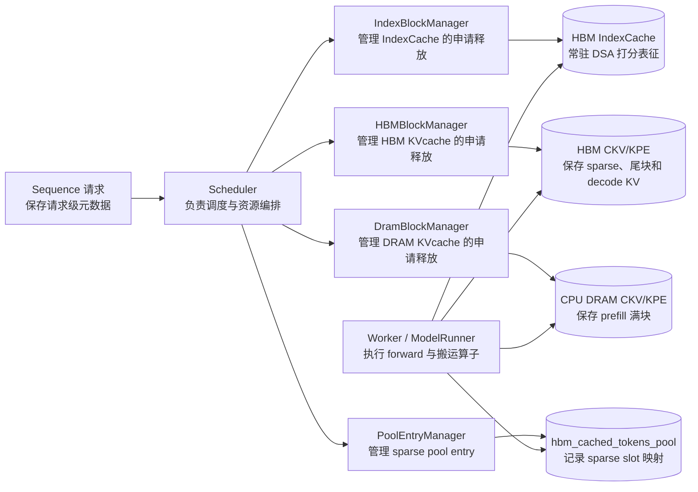
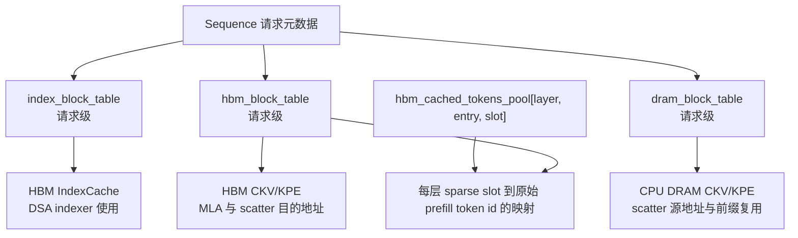
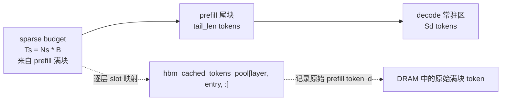
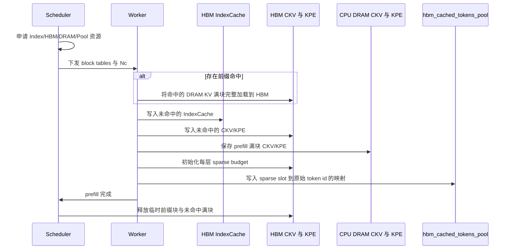
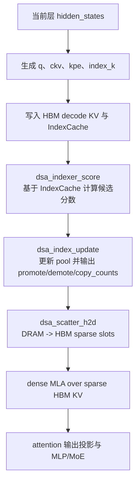
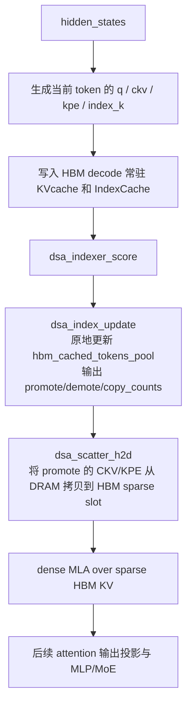
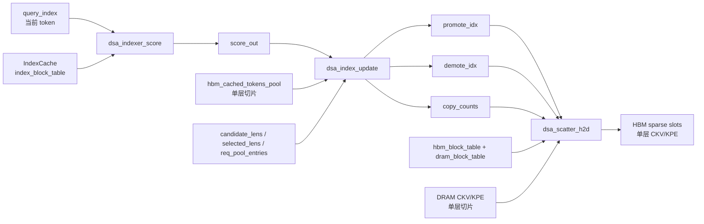

# Decode 阶段 KVcache 卸载设计文档

本文档描述 `nano-vllm-ascend-DeepSeekV32` 中 decode 阶段 KVcache 卸载机制的设计。设计目标是在长序列请求进入 decode 后，将 prefill 阶段的大部分 KVcache 从 NPU HBM 卸载到 CPU DRAM，只在 HBM 中保留一份可动态更新的 sparse budget，从而降低单请求显存占用，提高 decode batch size。

本文档描述稳定设计。阶段性实现取舍集中放在最后的“分阶段落地计划”中。

整体结构如下：



## 1. 目标和边界

本节界定这项工作的目标和不覆盖的范围。KVcache 卸载会同时影响调度、块管理、模型 forward 和算子接口，先明确边界有助于后续实现保持可验证。

### 1.1 目标

1. 对长序列请求，在 prefill 结束后将 prefill 满块对应的 CKV/KPE 卸载到 CPU DRAM。
2. 在 HBM 中保留一小段 sparse budget，并保留 prefill 尾部非满块和 decode 阶段新产生的 KVcache。
3. 在每个 decode step、每一层根据 DSA 打分结果，从 DRAM 召回当前更重要的 prefill layer_kv_token，并淘汰 HBM sparse budget 中分数较低的 layer_kv_token。
4. 使同一套框架接口同时兼容有损固定 `Tx` 策略和无损动态 `Tx` 策略。
5. 将 model.forward 需要的调度元数据尽量 tensor 化，避免 forward 内部出现细碎 H2D 拷贝。
6. decode forward 中新增逻辑必须支持组 batch，不能依赖逐请求 Python 循环来完成核心算子逻辑。

### 1.2 设计边界

1. IndexCache 常驻 HBM，不随 CKV/KPE 卸载到 DRAM。
2. decode 阶段新产生的 KVcache 不卸载到 DRAM。
3. HBM sparse budget 只管理 prefill 满块中的 layer_kv_token；prefill 尾部非满块和 decode 新 token 作为常驻上下文参与 MLA。
4. 抢占属于调度增强能力，不影响本设计的数据结构和算子接口。
5. SFA decode 与本设计正交。卸载后的 HBM sparse budget 以 paged dense MLA 作为 attention 计算路径。

## 2. 当前基线与可参考机制

本节说明当前 DeepSeek V3.2 基线中的 cache 形态，并总结 Qwen KVStar 改造中可以复用的工程模式。这里参考的是机制，不直接复用稠密 GQA 模型的算法细节。

### 2.1 当前 DeepSeek V3.2 cache 形态

当前 DeepSeek V3.2 在每个 TP rank 上按层分配 CKV/KPE/IndexCache。典型形状如下：

| 缓存 | 形状 | dtype | device | 说明 |
|---|---:|---|---|---|
| CKV cache | `tensor[(L, C, 1, B, 512), bf16, npu]` | bf16 | NPU | MLA latent KV，也可称为 nope cache |
| KPE cache | `tensor[(L, C, 1, B, 64), bf16, npu]` | bf16 | NPU | RoPE 部分的 K cache |
| IndexCache | `tensor[(L, C, B, 1, 128), bf16, npu]` | bf16 | NPU | DSA indexer 使用的 K 表征 |

其中 `L=61`，典型 `B=128`。当前基线中，一个请求的 `block_table` 同时索引 CKV、KPE 和 IndexCache。卸载后，这三类数据生命周期不同，需要拆成独立的 block table。

### 2.2 Qwen KVStar 改造中的可参考机制

已阅读 `D:\work\1.92_bakup\nano-vllm-kvstar-0321\` 中的 Qwen KVStar 改造。以下机制可迁移到 DSA 卸载设计中：

| Qwen KVStar 机制 | DSA 卸载中的对应设计 |
|---|---|
| `CPUBlockManager` 管理 CPU KV block，并通过链式 hash/refcount 支持前缀复用 | `DramBlockManager` 管理 DRAM CKV/KPE 满块，并支持 prefill 满块前缀复用 |
| `GPUBlockManager` 在 prefill 结束后释放被稀疏化的 GPU block | `HBMBlockManager` 在 sparse budget 初始化后释放不再常驻的 HBM KVcache block |
| `Sequence` 同时维护 `gpu_block_table` 和 `cpu_block_table` | `Sequence` 维护 `index_block_table`、`hbm_block_table`、`dram_block_table` |
| `selected_pool` 记录每个请求当前选中的稀疏集合 | `hbm_cached_tokens_pool` 记录每层每请求当前 HBM sparse slot 对应的原始 token id |
| batched incremental topk 同时更新 selected，并输出源/目的块 | `dsa_index_update` 更新 sparse slot 索引，并输出 `promote_idx/demote_idx/copy_counts` |
| scatter copy 根据源/目的物理块执行 H2D/D2H 搬运 | `dsa_scatter_h2d` 根据 promote/demote 和两套 block table 执行 DRAM 到 HBM 搬运 |

DSA 版本与 Qwen KVStar 版本的关键差异是粒度不同：Qwen 版主要按块和 GQA KV head 处理；DSA 卸载需要按 prefill layer_kv_token 处理，并且 IndexCache 必须常驻 HBM 参与每层打分。

## 3. 核心概念和符号

本节统一术语。本文中涉及 KVcache 的 token 均严格指 `layer_kv_token`，也就是一层中一个序列位置对应的 CKV/KPE 表征。

### 3.1 DSA 与 GT2048

DeepSeek V3.2 的 DSA 会为每个 query token 选择最多 2048 个历史 layer_kv_token 参与 attention。本文将某个 decode step、某一层中 DSA 真实选中的最多 2048 个 layer_kv_token 称为 `GT2048`。

如果卸载机制能保证该层该步的 `GT2048` 全部参与 MLA，则 attention 选择集合是无损的；如果不能保证，则是有损的。

### 3.2 KVcache 与 IndexCache

本文中的 KVcache 是 CKV cache 与 KPE cache 的统称：

| 名称 | 内容 | 单个 layer_kv_token 大小 |
|---|---|---:|
| CKV | latent KV，维度 512 | 512 个 bf16 |
| KPE | RoPE K，维度 64 | 64 个 bf16 |

一个 KVcache 物理块包含 `B` 个 layer_kv_token。典型 `B=128` 时，单层单块 CKV/KPE 大小为：

```text
B * (512 + 64) * sizeof(bf16)
= 128 * 576 * 2 bytes
= 147456 bytes
≈ 144 KiB
```

IndexCache 是 DSA indexer 使用的 K 表征，典型形状为：

```text
tensor[(L, Cidx, B, 1, 128), bf16, npu]
```

IndexCache 不卸载，因为 decode 每步每层都需要用它为候选 prefill layer_kv_token 计算重要性分数。

### 3.3 符号表

基础维度：

| 符号 | 含义 |
|---|---|
| `L` | 模型层数，DeepSeek V3.2 为 61 |
| `B` | KVcache block size，典型值为 128 |
| `Dckv` | 单个 layer_kv_token 的 CKV 维度，DeepSeek V3.2 中为 512 |
| `Dkpe` | 单个 layer_kv_token 的 KPE 维度，DeepSeek V3.2 中为 64 |
| `Dkv` | 单个 layer_kv_token 的 CKV/KPE 合计维度，`Dkv = Dckv + Dkpe = 576` |
| `Didx` | IndexCache 单 token 维度，DeepSeek V3.2 中为 128 |
| `Hidx` | DSA indexer 使用的 index head 数 |
| `Cidx` | HBM 上 IndexCache 物理块数量 |
| `Chbm` | HBM 上 KVcache 物理块数量 |
| `Cdram` | DRAM 上 KVcache 物理块数量 |
| `pool_capacity` | `hbm_cached_tokens_pool` 可同时容纳的请求槽位数 |
| `bs` | 一次 decode step 的 batch size |

单请求长度：

| 符号 | 含义 |
|---|---|
| `Sp` | 某请求 prefill token 数量 |
| `Sd` | 某请求截至当前层 MLA 调用前，已经写入 HBM KVcache、并会参与本次 MLA 的 decode token 数；第一步 decode 时 `Sd=1` |
| `Nprefill` | prefill 总块数，`Nprefill = ceil(Sp / B)` |
| `Np` | prefill 满块数量，`Np = Sp // B` |
| `Nr` | prefill 尾部非满块数量，`Nr = Nprefill - Np`，只可能为 0 或 1 |
| `tail_len` | prefill 尾部非满块 token 数，`tail_len = Sp - Np * B` |
| `Nd` | prefill 尾块加 decode 新 token 所需块数，`Nd = ceil((tail_len + Sd) / B)` |
| `Nc` | prefill 满块中可被前缀复用的块数 |
| `Ns` | prefill 满块卸载后，在 HBM 中保留的 sparse budget 块数 |
| `Ts` | HBM 中用于 prefill 历史的 sparse budget token 数，`Ts = Ns * B` |
| `Tp` | 参与候选的 prefill 满块 layer_kv_token 数，`Tp = Np * B` |
| `sparse_kv_len` | MLA 实际看到的 KV 长度，`sparse_kv_len = Ts + tail_len + Sd` |

运行时索引：

| 符号 | 含义 |
|---|---|
| `l` | 模型层 id，范围为 `[0, L)` |
| `b` | decode batch 内请求 id，范围为 `[0, bs)` |
| `e_b` | 第 `b` 个请求在 `hbm_cached_tokens_pool` 中的 pool entry |
| `t` | 原始 prefill 满块 token id，范围为 `[0, Tp)` |
| `s` | HBM sparse budget 本地 slot id，范围为 `[0, Ts)` |
| `i` | promote/demote 对的序号 |
| `Tcopy_b` | 第 `b` 个请求在某层某步实际搬运的 token 数，等于 `copy_counts[b]` |
| `Tx` | 固定有损策略下每请求每层每步搬运的 layer_kv_token 数量 |
| `GT2048` | DSA 在某 step、某层选择的最多 2048 个 layer_kv_token |

全局容量上限：

| 符号 | 含义 |
|---|---|
| `max_model_len` | 引擎配置的最大序列长度，设计默认用户不设置超过 131072 |
| `Nmax_prefill` | 配置范围内 prefill 总块数上限，`Nmax_prefill = ceil(max_model_len / B)` |
| `Nmax_sparse` | 配置范围内 sparse budget 块数上限，由 `Ns` 分段函数取最大值得到 |
| `Tmax_sparse` | `hbm_cached_tokens_pool` 的 token 维上限，`Tmax_sparse = Nmax_sparse * B` |
| `Tmax_candidate` | `score_out` 的 token 维上限，不超过 `max_model_len` |
| `Tmax_copy` | `promote_idx/demote_idx` 的 token 维上限；无损策略下为 2048 |
| `Nmax_index` | tensor 化 `index_block_tables` 的块数上限 |
| `Nmax_hbm` | tensor 化 `hbm_block_tables` 的块数上限 |
| `Nmax_dram` | tensor 化 `dram_block_tables` 的块数上限 |

后文如果写作 `Tp_b`、`Ts_b`、`Sd_b`，表示 batch 内第 `b` 个请求对应的取值。

### 3.4 索引映射与不变量

后文统一使用以下辅助函数描述块内寻址：

```text
blk(x) = x // B
off(x) = x % B
```

原始 prefill 满块 token id `t` 使用原始 prefill 语义；它通过 `dram_block_table[blk(t)]` 定位 DRAM 中的源块。HBM sparse slot id `s` 使用 sparse 语义；它通过 `hbm_block_table[blk(s)]` 定位 HBM sparse budget 中的目标块。

对 batch 内第 `b` 个请求、第 `l` 层：

```text
hbm_cached_tokens_pool[l, e_b, s] = t
```

表示该层 HBM sparse budget 的本地 slot `s` 当前保存的是原始 prefill 满块 token `t`。因此 `hbm_block_table` 可以保持请求级，不需要按层拆分；逐层差异完全由 `hbm_cached_tokens_pool[l, e_b, :]` 表达。

关键不变量如下：

1. `dram_block_table` 只覆盖 prefill 满块，候选 token 范围始终是 `[0, Tp)`。
2. `index_block_table` 使用原始序列语义，服务于 DSA indexer 打分。
3. `hbm_block_table` 在 decode 阶段使用 sparse 语义，前 `Ns` 个逻辑块为 sparse budget。
4. `hbm_cached_tokens_pool[l, e_b, 0:Ts]` 中的每个值都必须落在 `[0, Tp)`。
5. `promote_idx[b, i]` 是原始 prefill 满块 token id `t`，`demote_idx[b, i]` 是本地 sparse slot id `s`。
6. 仅 `0 <= i < Tcopy_b` 的 promote/demote 对有效，`Tcopy_b = copy_counts[b] <= Tmax_copy`。
7. 启用卸载的请求需要满足 `Ts >= 2048`；默认分段函数下实际最小值为 2560。

## 4. 总体数据布局

本节描述卸载后 CKV/KPE/IndexCache 分别在哪里、如何索引，以及 MLA 看到的序列是什么。

### 4.1 三类物理 cache

卸载后 Worker 维护三类物理 cache：

| cache | 形状 | device | 生命周期 |
|---|---:|---|---|
| `index_cache` | `tensor[(L, Cidx, B, 1, Didx), bf16, npu]` | NPU | prefill 满块、尾块、decode 新块均常驻 HBM |
| `hbm_ckv_cache` | `tensor[(L, Chbm, 1, B, Dckv), bf16, npu]` | NPU | prefill 阶段临时完整保存，decode 阶段仅保存 sparse budget、尾块和 decode 新块 |
| `hbm_kpe_cache` | `tensor[(L, Chbm, 1, B, Dkpe), bf16, npu]` | NPU | 同上 |
| `dram_ckv_cache` | `tensor[(L, Cdram, 1, B, Dckv), bf16, cpu]` | CPU DRAM | 保存 prefill 满块 |
| `dram_kpe_cache` | `tensor[(L, Cdram, 1, B, Dkpe), bf16, cpu]` | CPU DRAM | 保存 prefill 满块 |

DRAM cache 应优先使用 pinned memory。最终 H2D 路径由 `dsa_scatter_h2d` 负责，底层可替换为 CANN custom op。

### 4.2 三类 block table

每个请求维护三套 block table：

| block table | 指向 | 用途 |
|---|---|---|
| `index_block_table` | HBM IndexCache 物理块 | DSA indexer 对候选 layer_kv_token 打分 |
| `hbm_block_table` | HBM CKV/KPE 物理块 | MLA 读取 sparse HBM KV，以及 scatter 的目的地址 |
| `dram_block_table` | DRAM CKV/KPE 物理块 | scatter 的源地址，以及 DRAM 前缀复用 |

`hbm_block_table` 在 decode 阶段使用 sparse 语义。对启用卸载的请求，它的前 `Ns` 个逻辑块是 sparse budget，后续逻辑块是 prefill 尾部非满块和 decode 新 token 所在块。

三种 block table 都是请求级元数据，不需要按层拆分。不同层的 sparse budget 选中集合可能不同，但它们共享同一组 HBM sparse slot 物理位置；每一层的 sparse slot 到原始 prefill token id 的映射由 `hbm_cached_tokens_pool[layer, entry, :]` 区分。

三种 block_table 均统一使用**0**作为**null/padding block id**；真实物理块从**1**开始分配。

三类 block table 与物理 cache、逐层 sparse 映射的关系如下：



### 4.3 `hbm_cached_tokens_pool`

`hbm_cached_tokens_pool` 记录 HBM sparse budget 中每个 slot 对应的原始 prefill token id：

```text
hbm_cached_tokens_pool = tensor[(L, pool_capacity, Tmax_sparse), int32, npu]
```

其中：

```text
Tmax_sparse = B * Nmax_sparse
```

`Nmax_sparse` 由 sparse budget 分段函数在配置的 `max_model_len` 范围内取最大值得到。若 `max_model_len=131072` 且 `B=128`，默认分段函数下 `Np` 最大为 1024，`Ns=ceil(0.20*1024)=205`，因此：

```text
Tmax_sparse = 205 * 128 = 26240
```

这个形状比 `(L, max_decode_batch, max_model_len)` 更合适，因为 pool 只需要记录 HBM sparse budget 的 slot 到原始 token id 的映射，不记录全量序列。

## 5. Sparse Budget 与长度语义

本节定义 `Ns/Ts` 如何计算，以及 sparse HBM KV 的长度如何传递。这里是整个设计最容易混用原始序列长度和 sparse 长度的地方。

### 5.1 `Ns` 分段函数

`Ns` 表示 prefill 满块卸载后，仍在 HBM 中保留的 sparse budget 块数。默认分段函数如下：

| 条件 | `Ns` |
|---|---|
| `Np < 64` | `Np`，不启用卸载 |
| `64 <= Np < 128` | `ceil(0.30 * Np)` |
| `128 <= Np < 256` | `ceil(0.25 * Np)` |
| `256 <= Np < 512` | `ceil(0.22 * Np)` |
| `512 <= Np` | `ceil(0.20 * Np)` |

比例 `0.30/0.25/0.22/0.20` 应做成配置常量，便于后续调整质量与显存之间的折中。

对启用卸载的请求，设计要求：

```text
Ts = Ns * B >= 2048
```

默认分段函数中，最小启用卸载条件为 `64 <= Np < 128`，此时 `Ns >= ceil(64*0.30)=20`，因此 `Ts >= 2560`。如果后续调整分段比例，也应保持启用卸载时 `Ts >= 2048`。

### 5.2 Sparse MLA 长度

卸载后，MLA 不能使用原始 `Sp + Sd` 作为 KV 长度。MLA 看到的是 sparse HBM KV 序列：

```text
sparse_kv_len = Ts + tail_len + Sd
```

其中：

```text
tail_len = Sp - Np * B
```

也就是：

1. `Ts` 个来自 prefill 满块的 sparse budget layer_kv_token；
2. prefill 最后一个非满块中的 `tail_len` 个 layer_kv_token；
3. decode 阶段已经产生的 `Sd` 个 layer_kv_token。

其中 `Sd` 包含当前 decode step 已经写入 HBM KVcache 的新 token。因此第一步 decode 运行到 MLA 前，`Sd=1`。

传给 MLA 的 `actual_seq_lengths_kv`、`block_table`、slot mapping 都必须使用 sparse 语义，不能混用原始序列长度。KPE 已经包含原始 RoPE 位置信息，因此 prefill layer_kv_token 被放入 sparse slot 后仍可参与 MLA。

MLA 实际看到的 HBM KV 序列可以表示为：



## 6. 总体算法

本节从算法角度描述 prefill 和 decode 的完整流程，不涉及具体类字段如何实现。

### 6.1 Prefill 流程

对每个请求：

1. Scheduler 为请求申请 IndexCache HBM 块、KVcache HBM 块、KVcache DRAM 块和 pool entry。
2. 如果前缀复用命中，则 Scheduler 计算 `Nc`，Worker 在 prefill forward 前将命中的 DRAM KV 块完整加载到 HBM，使其参与 prefill attention。
3. Worker 执行 prefill forward，写入未命中的 CKV/KPE/IndexCache。
4. 每层 prefill 完成后，将 prefill 满块对应的 CKV/KPE 保存到 DRAM。
5. 根据分段函数计算 `Ns/Ts`，为每层初始化 HBM sparse budget。
6. 将每层选中的 `Ts` 个 prefill layer_kv_token 写入 `hbm_block_table` 的前 `Ns` 个 HBM KVcache 块中。
7. 写入 `hbm_cached_tokens_pool[layer, entry, :Ts]`，记录每个 sparse slot 对应的原始 prefill token id。
8. Scheduler 在 prefill 完成后释放不再常驻的 HBM KVcache 块；其中包括前缀命中时临时加载到 HBM 的前缀 KV 块，以及 prefill forward 计算出的未命中块。



### 6.2 Decode 流程

每个 decode step、每一层执行：

1. 生成当前 token 的 CKV/KPE/IndexCache，并写入 decode 常驻 HBM 块。
2. `dsa_indexer_score` 使用当前 query 的 index 表征和 HBM IndexCache，为 DRAM 中可候选的 prefill layer_kv_token 打分。
3. `dsa_index_update` 根据分数和 `hbm_cached_tokens_pool` 更新 sparse budget 的索引集合，输出：
   - `promote_idx`：需要从 DRAM 召回的原始 prefill token id；
   - `demote_idx`：需要在 HBM sparse budget 中覆盖的本地 slot id；
   - `copy_counts`：每个 batch item 本次实际需要拷贝的 layer_kv_token 数量。
4. `dsa_scatter_h2d` 根据 `promote_idx/demote_idx/copy_counts` 执行 CKV/KPE 从 DRAM 到 HBM sparse slot 的搬运。
5. dense MLA 在 sparse HBM KV 序列上计算 attention。



## 7. 有损与无损更新策略

本节定义两类 sparse budget 更新策略。两者共享同一套外部接口，差异收敛在 `dsa_index_update` 的内部策略和 `copy_counts` 的取值上。

### 7.1 固定 `Tx` 有损更新

固定 `Tx` 策略用于控制每步每层的召回成本。

对每个 batch item：

1. 从当前 HBM sparse budget 中按分数选出最低的 `Tx` 个 slot，作为 demote 集合。
2. 屏蔽已经在 HBM sparse budget 中的 token。
3. 从未缓存的 DRAM 候选 token 中选出分数最高的 `Tx` 个，作为 promote 集合。
4. 更新 `hbm_cached_tokens_pool`。
5. 输出 `copy_counts[b] = Tx`。

该策略不保证 `GT2048` 全覆盖，因此是有损策略。

### 7.2 动态 `Tx` 无损更新

动态 `Tx` 策略用于保证 `GT2048` 全部在 HBM 可见集合中。

对每个 batch item：

1. 对全量候选分数取 top 2048，得到 `GT2048`。
2. 计算 `GT2048` 中当前不在 HBM sparse budget 的集合，作为 promote 集合。
3. 令 `Tx_b = len(promote 集合)`。
4. 从当前 HBM sparse budget 中不属于 `GT2048` 的 layer_kv_token 里，选出分数最低的 `Tx_b` 个 slot，作为 demote 集合。
5. 更新 `hbm_cached_tokens_pool`。
6. 输出 `copy_counts[b] = Tx_b`。

无损策略要求 HBM sparse budget 能容纳 `GT2048` 中落在 prefill 满块范围内的 layer_kv_token。若启用卸载时始终保持 `Ts >= 2048`，则对 prefill 满块候选部分具备无损更新的容量前提。

### 7.3 接口兼容性结论

有损和无损策略对框架的影响应限制在以下位置：

1. `dsa_index_update` 内部如何选择 promote/demote；
2. `dsa_index_update` 输出的 `copy_counts` 是固定值还是动态值；
3. `dsa_scatter_h2d` 根据 `copy_counts` 只搬运每个 batch item 的有效前缀。

只要 `promote_idx/demote_idx` 预留容量为 `Tmax_copy`，并且接口包含 `copy_counts`，框架其余部分无需因有损/无损策略切换而改接口。无损策略下 `Tmax_copy` 定义为 2048；固定 `Tx` 有损策略只使用前 `Tx` 个有效槽位。

## 8. BlockManager 设计

本节定义三类块管理器。拆分的原因是 IndexCache、HBM KVcache 和 DRAM KVcache 的生命周期不同。

### 8.1 IndexBlockManager

职责：

1. 管理 HBM 上的 IndexCache 物理块。
2. 为 prefill 满块、prefill 尾块和 decode 新块分配 IndexCache 块。
3. 支持 prefill 满块前缀复用。
4. 不参与 DRAM 卸载。

hash 语义：

| 阶段 | 是否参与 hash 复用 | 原因 |
|---|---|---|
| prefill 满块 | 是 | 同 prompt 前缀可复用 IndexCache |
| prefill 尾块 | 否 | 非满块不作为稳定前缀块 |
| decode 新块 | 否 | decode 结果依赖采样，不复用 |

### 8.2 HBMBlockManager

职责：

1. 管理 HBM 上的 CKV/KPE 物理块。
2. prefill 阶段临时容纳完整 KVcache。
3. decode 阶段只保留 sparse budget、prefill 尾部非满块和 decode 新块。
4. 当 decode 新 token 填满当前块时，申请新的 HBM KVcache 块。

HBM KVcache 不做前缀复用，因此不需要 hash/refcount 前缀缓存语义。

prefill 完成后的释放规则：

1. Worker 已将重要 prefill layer_kv_token 打包到 `hbm_block_table` 前 `Ns` 个块。
2. Scheduler 调用 HBMBlockManager 释放 prefill 满块中不再常驻的 HBM 块。
3. `hbm_block_table` 保留 sparse MLA 需要的逻辑顺序：sparse budget 块在前，尾块和 decode 块在后。

### 8.3 DramBlockManager

职责：

1. 管理 CPU DRAM 上的 CKV/KPE 物理块。
2. 只保存 prefill 满块。
3. 支持 prefill 满块前缀复用。
4. 不保存 prefill 尾部非满块和 decode 新 token。

DramBlockManager 的 hash/refcount 机制可参考 Qwen KVStar 的 `CPUBlockManager`：

1. 对 prefill 满块做链式 hash；
2. hash 命中后仍校验 token id，避免 hash 碰撞；
3. 物理块使用 refcount 管理多个请求共享；
4. refcount 归零后块回到空闲队列。

### 8.4 前缀命中 `Nc`

前缀复用需要同时命中 IndexCache 和 DRAM KVcache。Scheduler 计算：

```text
Nc = min(IndexBlockManager 命中块数, DramBlockManager 命中块数)
```

只有前 `Nc` 个连续 prefill 满块视为可复用。若其中任一 manager 在某块处 miss，则该块及其后的 prefill 满块都按未命中处理。

### 8.5 PoolEntryManager

PoolEntryManager 管理 `hbm_cached_tokens_pool` 的槽位。每个启用卸载的请求需要独占一个 `hbm_cached_tokens_pool_entry`，也就是运行时符号 `e_b`，用于索引：

```text
hbm_cached_tokens_pool[:, hbm_cached_tokens_pool_entry, :]
```

职责：

1. 请求进入 prefill 调度时分配 entry。
2. 请求结束或被释放时归还 entry。
3. 保证同一时刻处于运行状态的卸载请求不会写同一个 pool 槽位。
4. 为 `prepare_decode()` 提供 `req_pool_entries = tensor[(bs,), int32, npu]`。

## 9. Sequence 设计

本节定义单个请求需要保存的新增元数据。调度器和 Worker 通过这些字段建立请求到三类物理 cache 的映射。

| 字段 | 类型 | 含义 |
|---|---|---|
| `index_block_table` | `list[int]` | IndexCache 的 HBM 物理块号 |
| `hbm_block_table` | `list[int]` | HBM CKV/KPE 的物理块号，decode 阶段使用 sparse 语义 |
| `dram_block_table` | `list[int]` | DRAM CKV/KPE 的物理块号，只覆盖 prefill 满块 |
| `hbm_cached_tokens_pool_entry` | `int` | 该请求在 `hbm_cached_tokens_pool` 中的槽位 |
| `num_prefill_blocks` | `int` | `Nprefill` |
| `num_prefill_full_blocks` | `int` | `Np` |
| `num_prefill_tail_blocks` | `int` | `Nr` |
| `num_prefix_cached_blocks` | `int` | `Nc` |
| `num_sparse_blocks` | `int` | `Ns` |
| `num_sparse_tokens` | `int` | `Ts` |
| `prefill_tail_len` | `int` | `tail_len` |
| `offload_enabled` | `bool` | 是否启用 decode KVcache 卸载 |

`hbm_block_table` 的语义需要明确：

1. prefill 期间，它可临时表示完整 prefill KVcache 的 HBM 块。
2. prefill 完成后，它必须切换到 sparse 语义。
3. decode 期间，MLA、slot mapping 和 `dsa_scatter_h2d` 都使用 sparse 语义的 `hbm_block_table`。

## 10. Scheduler 设计

本节描述调度器如何在 prefill/decode 阶段分配和释放资源。

### 10.1 Prefill 准入

调度一个等待请求进入 prefill 时，需要同时满足：

1. IndexBlockManager 可分配或复用 `Nprefill` 个 IndexCache HBM 块。
2. HBMBlockManager 可分配 `Nprefill` 个 KVcache HBM 块。
3. DramBlockManager 可分配或复用 `Np` 个 DRAM KVcache 满块。
4. 若启用卸载，PoolEntryManager 可分配一个 `hbm_cached_tokens_pool_entry`。
5. 请求长度满足 `max_model_len`，且 prefill/decode 调度满足 `max_num_prefill_seqs_per_step`、`max_num_decode_seqs_per_step` 等引擎限制。

对启用前缀复用的请求，Scheduler 先分别查询 IndexBlockManager 和 DramBlockManager 的前缀命中块数，再按 `Nc = min(index_hits, dram_hits)` 记录可复用前缀。

### 10.2 Prefill 完成后的 HBM 释放

prefill forward 完成并且 Worker 已完成 DRAM offload 和 sparse budget 初始化后，Scheduler 执行：

1. 将请求的 `hbm_block_table` 调整为 sparse 语义。
2. 调用 HBMBlockManager 释放不再常驻的 prefill 满块 HBM 物理块。
3. 保留 sparse budget 块、prefill 尾部非满块和 decode append 需要的块。

### 10.3 Decode 调度

decode 阶段调度时：

1. 如果 decode 常驻 KV 的最后一个 HBM 块写满，向 HBMBlockManager 申请新块。
2. 如果 IndexCache 最后一个块写满，向 IndexBlockManager 申请新块。
3. decode 新 token 不向 DramBlockManager 申请。
4. 调度器需要为当前 batch 准备可 tensor 化的 block table 和长度元数据。

## 11. Worker 与 tensor 化元数据

本节描述 Worker 在进入 model.forward 前需要准备哪些 tensor。原则是：model.forward 内部只消费 tensor，不再从 Python 对象逐项取元数据并触发小 H2D。

### 11.1 物理 tensor

Worker 初始化时维护：

| tensor | 形状 | device | 说明 |
|---|---:|---|---|
| `index_cache` | `tensor[(L, Cidx, B, 1, Didx), bf16, npu]` | NPU | DSA indexer 使用 |
| `hbm_ckv_cache` | `tensor[(L, Chbm, 1, B, Dckv), bf16, npu]` | NPU | HBM CKV |
| `hbm_kpe_cache` | `tensor[(L, Chbm, 1, B, Dkpe), bf16, npu]` | NPU | HBM KPE |
| `dram_ckv_cache` | `tensor[(L, Cdram, 1, B, Dckv), bf16, cpu]` | CPU DRAM | DRAM CKV |
| `dram_kpe_cache` | `tensor[(L, Cdram, 1, B, Dkpe), bf16, cpu]` | CPU DRAM | DRAM KPE |
| `hbm_cached_tokens_pool` | `tensor[(L, pool_capacity, Tmax_sparse), int32, npu]` | NPU | sparse slot 到原始 token id 的映射 |

### 11.2 Decode 前 tensor 化元数据

`prepare_decode()` 额外准备：

| tensor | 形状 | dtype | device | 说明 |
|---|---:|---|---|---|
| `index_block_tables` | `tensor[(bs, Nmax_index), int32, npu]` | int32 | NPU | IndexCache block table |
| `hbm_block_tables` | `tensor[(bs, Nmax_hbm), int32, npu]` | int32 | NPU | sparse HBM KVcache block table |
| `dram_block_tables` | `tensor[(bs, Nmax_dram), int32, npu]` | int32 | NPU | DRAM KVcache block table |
| `req_pool_entries` | `tensor[(bs,), int32, npu]` | int32 | NPU | 每个请求对应的 pool entry，即 `e_b` |
| `candidate_lens` | `tensor[(bs,), int32, npu]` | int32 | NPU | 每个请求参与候选的 prefill 满块 token 数，等于 `Tp` |
| `sparse_selected_lens` | `tensor[(bs,), int32, npu]` | int32 | NPU | 每个请求当前 sparse budget 有效长度，等于 `Ts` |
| `prefill_tail_lens` | `tensor[(bs,), int32, npu]` | int32 | NPU | 每个请求 prefill 尾部非满块 token 数，等于 `tail_len` |
| `decode_lens` | `tensor[(bs,), int32, npu]` | int32 | NPU | 每个请求 decode 常驻 token 数，等于 `Sd` |
| `sparse_kv_lens` | `tensor[(bs,), int32, npu]` | int32 | NPU | MLA 使用的 sparse KV 长度，等于 `sparse_kv_len` |

这些 tensor 放入 `Context`，供每层 forward 使用。

## 12. 模型 forward 设计

本节描述 `deepseek_v32.py` 中 prefill 和 decode forward 需要新增的逻辑。

### 12.1 Prefill forward

prefill forward 的主要职责：

1. 写入未命中的 CKV/KPE/IndexCache。
2. 对 prefill 满块的 CKV/KPE 建立 DRAM 副本。
3. 初始化每层 HBM sparse budget。
4. 写入 `hbm_cached_tokens_pool[layer, entry, :Ts]`。

如果存在 `Nc > 0` 的前缀命中，命中部分的 IndexCache 和 DRAM KVcache 由 block table 指向复用物理块。命中的 DRAM KV 块会在 prefill forward 前完整加载到 HBM，参与本次 prefill attention；prefill 结束后，这些临时 HBM 前缀块与未命中块一起释放，只保留 sparse budget、尾块和 decode 后续需要的块。

### 12.2 Decode forward

每层 decode forward 的数据流如下：



MLA 的输入必须使用：

```text
sparse_kv_lens = Ts + tail_len + Sd
```

以及 sparse 语义的 `hbm_block_tables`。

## 13. 算子接口设计

本节定义三个新增算子的稳定接口。

三者在单层 decode 中的输入输出关系如下：



### 13.1 `dsa_indexer_score`

功能：根据当前 query 的 index 表征和 HBM IndexCache，为每个候选 prefill layer_kv_token 计算重要性分数。

接口定义：

```python
def dsa_indexer_score(
    query_index,          # tensor[(bs, Hidx, Didx), bf16, npu]
    index_cache,          # tensor[(Cidx, B, 1, Didx), bf16, npu]
    index_weights,        # tensor[(bs, Hidx), bf16, npu]
    index_block_table,    # tensor[(bs, Nmax_index), int32, npu]
    candidate_lens,       # tensor[(bs,), int32, npu]
    score_out,            # tensor[(bs, Tmax_candidate), bf16, npu]
):
    ...
```

输出语义：

```text
score_out[b, t] = 第 b 个请求中原始 prefill 满块 token id 为 t 的 layer_kv_token 分数
```

只有 `0 <= t < candidate_lens[b]` 的位置有效，其中 `candidate_lens[b] = Tp_b`。无效位置应被置为足够小的哨兵值。

### 13.2 `dsa_index_update`

功能：根据分数更新 HBM sparse budget 的索引集合。该算子只更新索引，不搬运 CKV/KPE。

接口定义：

```python
def dsa_index_update(
    score,                     # tensor[(bs, Tmax_candidate), bf16, npu], input/output
    hbm_cached_tokens_pool,    # tensor[(pool_capacity, Tmax_sparse), int32, npu], input/output，单层切片
    promote_idx,               # tensor[(bs, Tmax_copy), int32, npu], output
    demote_idx,                # tensor[(bs, Tmax_copy), int32, npu], output
    copy_counts,               # tensor[(bs,), int32, npu], output
    candidate_lens,            # tensor[(bs,), int32, npu]
    selected_lens,             # tensor[(bs,), int32, npu]
    req_pool_entries,          # tensor[(bs,), int32, npu]
    max_copy_tokens: int,       # 等于 Tmax_copy；无损策略取 2048，固定 Tx 策略可小于 2048
):
    ...
```

索引语义：

| tensor | 语义 |
|---|---|
| `promote_idx[b, i]` | 原始 prefill 满块 token id `t`，范围为 `[0, candidate_lens[b])` |
| `demote_idx[b, i]` | HBM sparse budget 本地 slot id `s`，范围为 `[0, selected_lens[b])` |
| `copy_counts[b]` | 第 `b` 个请求本次有效 promote/demote 对数，即 `Tcopy_b` |

对每个 batch item，仅 `0 <= i < Tcopy_b` 的 `promote_idx/demote_idx` 有效。剩余位置由实现填充任意合法值或 0，`dsa_scatter_h2d` 必须忽略。

固定 `Tx` 策略中，`copy_counts[b] = Tx`。无损动态策略中，`copy_counts[b]` 等于该请求该层该步中 `GT2048` 尚未驻留 HBM 的 layer_kv_token 数。

### 13.3 `dsa_scatter_h2d`

功能：根据 `promote_idx/demote_idx/copy_counts`，把 CKV/KPE 从 DRAM 拷贝到 HBM sparse budget。

接口定义：

```python
def dsa_scatter_h2d(
    promote_idx,          # tensor[(bs, Tmax_copy), int32, npu]
    demote_idx,           # tensor[(bs, Tmax_copy), int32, npu]
    copy_counts,          # tensor[(bs,), int32, npu]
    hbm_block_table,      # tensor[(bs, Nmax_hbm), int32, npu]
    dram_block_table,     # tensor[(bs, Nmax_dram), int32, npu]
    hbm_ckv_cache,        # tensor[(Chbm, 1, B, Dckv), bf16, npu], input/output，单层切片
    hbm_kpe_cache,        # tensor[(Chbm, 1, B, Dkpe), bf16, npu], input/output，单层切片
    dram_ckv_cache,       # tensor[(Cdram, 1, B, Dckv), bf16, cpu]，单层切片
    dram_kpe_cache,       # tensor[(Cdram, 1, B, Dkpe), bf16, cpu]，单层切片
):
    ...
```

地址映射：

```text
源地址：
  t = promote_idx[b, i]
  dram_logical_block = blk(t)
  dram_offset = off(t)
  dram_physical_block = dram_block_table[b, dram_logical_block]

目的地址：
  s = demote_idx[b, i]
  hbm_logical_block = blk(s)
  hbm_offset = off(s)
  hbm_physical_block = hbm_block_table[b, hbm_logical_block]
```

循环范围由 `Tcopy_b = copy_counts[b]` 决定：

```text
for i in range(Tcopy_b):
    copy CKV/KPE from DRAM source to HBM destination
```

`dsa_scatter_h2d` 的最终实现预计由 AIV 发起并行拷贝；设计仍保留 timing 观测点，用于确认实际带宽和 TPOT 影响。

## 14. TP 策略

本节说明 TP 场景下新增逻辑如何保持一致。

所有 TP rank 拥有相同的 `Cidx/Chbm/Cdram` 配置，并在本 rank 上维护本 rank 需要的 CKV/KPE/IndexCache 物理 cache。`dsa_indexer_score`、`dsa_index_update` 和 `dsa_scatter_h2d` 可在各 TP rank 冗余执行。

冗余执行的优点：

1. 不需要在 decode 每层增加 rank0 到其他 rank 的 broadcast。
2. `promote_idx/demote_idx/copy_counts` 由相同输入确定，语义上可保持一致。
3. H2D 搬运仍由各 rank 搬运本 rank 的 CKV/KPE 切片。

后续也可优化为 rank0 计算 `promote_idx/demote_idx/copy_counts` 后广播。是否采用该优化取决于 indexer/update 耗时与广播同步开销的对比。

## 15. 资源规模与观测指标

本节记录关键资源规模和必须观测的指标，用于后续验证设计是否达到目标。

### 15.1 score tensor 规模

`dsa_indexer_score` 输出全量候选分数：

```text
score_out = tensor[(bs, Tmax_candidate), bf16, npu]
```

`Tmax_candidate` 不超过 `max_model_len`。在默认最大序列长度 `max_model_len <= 131072` 下，即使 `bs=256`：

```text
256 * 131072 * 2 bytes = 64 MiB
```

该规模可接受。设计不额外处理用户设置 `max_model_len > 131072` 的情况。

### 15.2 IndexCache 常驻 HBM 容量

IndexCache 常驻 HBM 是本设计的必要代价。典型 `B=128` 时，单层单块 IndexCache 大小为：

```text
B * 128 * sizeof(bf16)
= 128 * 128 * 2 bytes
= 32768 bytes
≈ 32 KiB
```

全 61 层单块约：

```text
61 * 32 KiB ≈ 1.91 MiB
```

如果 `max_model_len=131072` 且 `B=128`，则 `Nmax_prefill=1024`。满长请求需要 `1024` 个 IndexCache block，全 61 层约：

```text
1024 * 1.91 MiB ≈ 1.91 GiB
```

因此 IndexCache 虽显著小于完整 CKV/KPE，但仍会影响 `Cidx` 和长序列 decode batch size。调度器需要把 IndexCache HBM block 作为独立资源管理。

### 15.3 元数据规模

多份 block table 和长度 tensor 的体量远小于 KVcache。关键要求不是减少这些元数据本身，而是在 model.forward 前完成 tensor 化，使 forward 内部能够算子化执行，避免每层每步细碎 H2D。

### 15.4 性能观测项

需要记录以下 timing：

1. prefill 后 CKV/KPE D2H 卸载耗时；
2. sparse budget 初始化耗时；
3. `dsa_indexer_score` 耗时；
4. `dsa_index_update` 耗时；
5. `dsa_scatter_h2d` 耗时和有效带宽；
6. dense MLA 耗时；
7. decode TPOT、decode TPS 和可调度 batch size 上限。

## 附录：设计文档提纲（提示词）

````
摘要：
借助 deepseek v32 的稀疏 attention 机制（Deepseek sparse attention, DSA），在 decode 阶段做 KVcache-offloading ，在 prefill 结束时将大部分 KVcache 卸载到 CPU DRAM 上，这样一个请求一旦进入 decode，大部分 HBM KVcache就会被释放，从而降低显存占用，在显存有限的情况下提升 decode batch-size 。
此外，这项技术最关键的就是要在 HBM 上（也就是这个请求的大部分显存块被释放后，这个请求剩余的 KVcache HBM 块内）维护一些热的 KVcache tokens 作为缓存，并在每个 decode step 动态召回一部分当前急需的 KVcache tokens ，并淘汰另一部分分数最低的 KVcache tokens 。


概念说明：
0. DSA : deepseek sparse attention 
1. KVcache : deepseekv32 是把原本的 KVcache 压缩成 kpe cache 和 ckv cache (也叫 nope cache) 。所以本文之后提到 KVcache 是指 kpe cache + ckv cache 的统称。 它们的 shape 应该是 .....
2. Indexcache : 是指 deepseek v3.2 的 indexer 对应的 k 表征 。 Indexcache = [(L, Cidx, B=128, 1, head_dim=128), bf16, npu]
3. layer_kv_token : 一层的1个token对应的KVcache
4. ground_truth 2048 : 是指 DSA 在某一decode step的某一层选中的 2048 个 token 。简称 GT2048 。如果 GT2048 全部参与了 attention 计算，我们就认为推理是无损的。如果无法保证 GT2048 全都参与 attention 计算，则认为推理是有损的。
5. 文档约定使用 tensor[shape, dtype, device=cpu/npu] 这种形式来描述一个tensor
6......


符号说明： 
0. 模型相关
    L = 61 : 模型层数
1. nanovllm引擎相关：
    Cidx  : HBM 上 Indexcache 的物理块数量。也即 IndexBlockManager 管理的物理块数量
    Chbm  : HBM 上 KVcache 的物理块数量。也即 HBMBlockManager 管理的物理块数量
    Cdram : DRAM 上 KVcache 的物理块数量。也即 DramBlockManager 管理的物理块数量
    max_decode_batch : 一次调度允许的最大 decode batch-size
    max_model_len : 模型最大支持的序列长度。理论上是模型参数，但实际上nanovllm引擎可以设置，所以算引擎参数。
2. 每次decode 调度相关：
    bs : decode batch size ，也就是一次 decode llm.step() 的并发处理的请求数
3. 站在一个请求的角度：
    3.1  B  : nano-vLLM KVcache block size (典型 B=128)
    3.2  Sp : 请求的 prefill 序列长度 (tokens)
    3.3  Sd : 请求的 当前已经 decode 的 token 数量。 prefill阶段 Sd=0, 第一步decode时 Sd=1，第2步decode时 Sd=2
    3.4  Np : 请求的 prefill 需要的整块的数量， Np = Sp / B (向下取整)
    3.5  Nr : 请求的 prefill 末尾非满块需要的块数， Nr=(Sp+B-1)/B -  Np ，只可能取 0 或者 1。如果 Sp 刚好能整除 b ，则 r=0 ，如果 Sp 不能整除 b ，则 r=1
    3.6  Nd : 请求的 prefill 末尾非满块以及 decode 新产生的 token 所需的块数量。 Nd = (Sp+Sd+B-1)/B - Np
    3.7  Nc : 请求的 Np中命中 DRAM 的块数（前缀缓存）
    3.8  (Np-Nc) : 请求的 未命中 DRAM 的块数（非前缀缓存）
    3.9  Ns : 请求的 HBM sparse budget block count ，请求原本有 Np 个 prefill 块，在 prefill 结束后，针对 prefill 块保留 Ns 个块，用来作为 HBM sparse budget blocks 。而 Np 个块则全部被卸载到 DRAM 。因此，HBM上一共有 Ns*B 个稀疏token预算。后续的稀疏都是从 DRAM 上的 Np*B 个 token 中挑选重要的 token 加载到 Ns 个块中，同时淘汰 Ns 个块中不重要的 token 。
    3.10 Tp=Np*B : 从DRAM上参与稀疏候选的 layer_kv_token 的数量
    3.11 Ts=Ns*B : 在HBM上存放的被缓存的 layer_kv_token 的数量（或者叫token数量预算更合适）。必然有 Ns ≤ Np
    3.12 Tx   : 该请求每个 decode step 的每一层，从 DRAM 加载到 HBM 的 token 数量。可能每步每层都不一样，也可能一样。取决于具体采用什么算法。


零、背景、deepseek v3.2 的 DSA (deepseek sparse attention) 机制：
    1. 背景：简要介绍一下 DSA
    2. 机遇和挑战：长序列下，每个请求占较大的显存，导致decode batch-size首先，GPU/NPU算力用不满，导致算力浪费，TPS远不如短序列decode。


一、DSA稀疏卸载算法设计：
    本节只描述算法，不涉及框架方案，先给读者一个overview。我们使用一种 "动态缓存更新" 的方法来进行 DSA 卸载。算法流程如下：
    1. 在prefill结束后，卸载全部的 KVcache （也即Np*）到 DRAM 。同时，在 prefill 进行到各层时，使用 prefill 阶段的 indexer 挑选重要的 top Ts 个 layer_kv_token 加载到 HBM 上。
    2. 在每个decode step的每一层： 
       2.1 token分数计算：先使用 indexer 机制，对每个 token 打分，得到 score 
       2.2 缓存更新算法：在 HBM 上已有的 Ts 个 token 中，挑选 Tx 个不重要的（称为 demote tokens）。再在 DRAM 上挑选 Tx 个重要的（称为 promote tokens），把重要的 token 加载来，覆盖掉不重要的。具体有2种算法：
           2.2.1 无损算法 （Tx不是固定值）： 
               - 对 score 求 top2048 得到 GT2048 ，
               - 求 Tx = GT2048 - Ts (求差集，这里写的不是很严谨) 作为 promote tokens 
               - 在 Ts - GT2048 差集中找出 bottom-Tx (最低Tx的分数) 作为 demote tokens 
               - 用 promote tokens 加载上来覆盖 demote tokens 。 
               - 最后，用 MLA 算子计算全部 HBM 上的 Ts 个 tokens 的 attention 。注意这里不是用 sparse_flash_attention (sfa) 而是 MLA ，是因为 Ts 个 token 在 HBM上反倒是 page 粒度存储的，可以用 MLA 。
               - 由于这种方法能保证 GT2048 全部参与 MLA ，因此被认为是无损。
           2.2.2 有损算法（Tx会是一个固定值，该固定值可调）： 
               - 对HBM 上的 Ts 个 token 按分数求 bottom-Tx ，作为 demote tokens 
               - 对 "HBM上没有，但是DRAM上已有" 的 Tp-Ts 个 tokens 按分数求 top-Tx ，作为 promote tokens 。
               - 用 promote tokens 加载上来覆盖 demote tokens 。 
               - 最后，用 MLA 算子计算全部 HBM 上的 Ts 个 tokens 的 attention 。同上。
           
       


二、框架方案overview （为了支持上述算法，设计了以下推理框架方案）
1. 站在请求角度：请求在 prefill 阶段，申请 Np+Nr 个 KVcache 块 ，……
2. 站在框架改造的角度，包括几大改造：
    1. 块管理器：将 nanovllm 原本的 1 个块管理器 (BlockManager) 拆分为3个，目的是使得它们能被独立申请和释放：
        1.1 IndexBlockManager (for IndexCache on HBM)，块数 = Cidx
        1.2 HBMBlockManager (for KVcache on HBM)，块数 = Chbm 
        1.3 DramBlockManager (for KVcache on DRAM) ，块数 = Cdram
         * 注意：应该让 Cidx 略大于 Cdram ，Cdram 远远大于 Chbm 。 应该加入一个 nanovllm 超参数来控制 Cdram / Chbm 的比值。
    2. Sequence对象（请求对象）：需要加入一些元数据成员变量：
        2.1 index_block_table, hbm_block_table, dram_block_table
        2.2 Np 等元数据，从而让 worker 能够知道
        2.3 需要加入 int 形元数据 hbm_cached_tokens_pool_entry
    3. Scheduler 调度器：
        3.1 当决定一个请求能否调度，原本只要看 BlockManager 是否能申请到，现在是要看 3 种 BlockManager 是否都能申请到。
        3.2 在prefill结束时要从 HBMBlockManager 中释放一部分 
        3.3 需要加入 HBMcachedTokensPoolEntryManager ，每个请求用它来申请 hbm_cached_tokens_pool_entry ，用来指向 hbm_cached_tokens_pool 中的一个槽位。请求结束时，需要释放 hbm_cached_tokens_pool_entry ，以便它能被其它请求使用。
    4. Worker (ModelRunner)：
        4.1 需要加入物理块 tensors: IndexCache、hbm_kvcache、cpu_kvcache
        4.2 需要加入 tensor: hbm_cached_tokens_pool = [(L, max_decode_batch, max_model_len), int32, npu], 该 tensor 用于记录各个请求的各层在当前的 decode step 缓存的 token 索引。（这也是我面的缓存更新算法的关键）。
             注意： hbm_cached_tokens_pool 是一个池子，一个请求 req 在其中会占用槽位 hbm_cached_tokens_pool[:, req.hbm_cached_tokens_pool_entry, :]
             * 之所以这里要把 hbm_cached_tokens_pool 做成 "槽位申请释放制" ，是因为 model.forward() 会更新 hbm_cached_tokens_pool , 下一个decode step 也要使用更新后的 hbm_cached_tokens_pool
        4.3 在 model.forward 开始前，需要额外 tensor 化一些东西，以便后续 model.forward 时能做到全算子化。
            当前所有组batch进行decode的请求的 req.hbm_cached_tokens_pool_entry 需要算子化成一个 tensor : req_pool_entries = [(bsz,), int32, npu]
    5. Worker内的模型forward流程（deepseek_v32.py）：
        5.3 需要加入3个算子：
            - dsa_indexer_score ：计算分数，相当于原本 npu_lightning_indexer 的前半部分算分数的部分
            - dsa_index_update ：缓存索引更新算子：挑选 promote 和 demote tokens 。其具体实现决定了是 2.2.1无损算法 还是 2.2.2有损算法 
            - dsa_scatter_h2d ：根据 dsa_index_update 的结果，执行实际的 H2D 搬移。


三、站在每个请求的角度讲，应该是以下流程：
1. prefill阶段：
    1.1 scheduler侧： 申请 (Np+Nr) 个 HBM blocks 和 Np 个 DRAM blocks 。并用哈希匹配前缀缓存命中，假设 Np 中有 Nc 个前缀块缓存命中。
    1.2 worker侧： 
        1.2.1 将 Nc 个命中的块从 DRAM 加载到 HBM (为了简单起见，不需要流水加载，在 model.forward 之前加载就行)
        1.2.2 运行 model.forward() ，将计算出的 (Np-Nc) 个未命中的 KVcache 块填入 HBM。此外，也要填入 Nr 这个非满块到 HBM 
              - 每层运行结束后，将 (Np-Nc) 个计算出的块从 HBM 卸载到 DRAM 。然后，挑选重要的 Ts=Ns*B 个 tokens ，放到 Np 个 HBM 块中的前 Ns 个块内。相当于初始化缓存
    1.3 scheduler侧： worker 工作结束后，释放大部分HBM块（被释放的块后面会允许其它请求占用），保留一小部分。关于保留的数量，是一个分段函数：
        情况1  Np<64, 不释放。相当于序列长度 <8192 时，不做 decode 卸载，Ns = Np
        情况2  64  ≤ Np < 128, Ns = Np * 0.30 (向上取整)
        情况3  128 ≤ Np < 256, Ns = Np * 0.25 (向上取整)
        情况4  256 ≤ Np < 512, Ns = Np * 0.22 (向上取整)
        情况5  512 ≤ Np      , Ns = Np * 0.20 (向上取整)
        实际上，以上参数 0.30, 0.25, 0.22, 0.20 都做成宏定义。
        注意：应该从每个请求的 block_table 的末尾开始释放，保留前面的 Ns 个块。因为之前 model.forward 中已经挑选了重要的 tokens 到前面 Ns 个块中。
2. decode阶段：
    2.1 scheduler侧： 如果一个请求的最后一个 KVcache 块满了，就从 IndexBlockManager 和 HBMBlockManager 申请新块。decode阶段的 KVcache 不参与卸载。
    2.2 worker侧： 
        - 每层运行 dsa_indexer_score、dsa_index_update、dsa_scatter_h2d 。
        - 然后在 Ns 个稀疏budget块和 Nd 个 decode tokens 上计算 MLA （注意这里用MLA而不是SFA）


四、块管理器详细设计：
1. 修改前：
   原本的 nano-vLLM 只有 BlockManager。对于 deepseekv32 模型来说，当请求进入 prefill 阶段时、或者 decode 攒满一个块时，需要从 BlockManager 中申请 HBM 块号，对于每个请求，会有一个 request.block_table ，也即它申请的块号。 request.block_table 共同管理 KVcache (KVcache包括了 kpe cache 和 nope cache 。以后说 KVcache 都是指 kpe cache + ) 和 IndexCache (IndexCache 是指 deepseek v3.2 的 indexer 对应的 k 表征）。此外，BlockManager 还能通过 hash 匹配，实现 GPU 上的前缀缓存复用（对于 deepseekv32 ，其实 KV）。
2. 修改后：需要将 BlockManager 解耦为三个 BlockManager
   2.1  IndexBlockManager : 管理 HBM 上的 IndexCache (包括prefill和decode阶段新产生的)。IndexCache 是不会卸载到 DRAM 的。允许 prefill 阶段的满块进行前缀复用，只有 prefill 阶段的满块会保留合法的 hash 。
   2.2  HBMBlockManager : 管理 HBM 上的 KVcache 。完全不允许任何前缀复用，因此完全不需要 hash 机制。
        2.2.1 当一个请求在prefill阶段，HBMBlockManager 管理该请求的 prefill 阶段的全量 KVcache 
        2.2.2 当一个请求在decode阶段， HBMBlockManager 管理该请求的 prefill 阶段的一部分 KVcache (token粒度打散)，以及 decode 阶段新产生的全部 KVcache . decode 阶段新产生的 KVcache 并不会卸载到 DRAM ，而是全部放在 HBM 上。
   2.3  DramBlockManager : 管理卸载到 DRAM 上的 KVcache 。只有 prefill 序列的满块会卸载到 DRAM ，且允许前缀复用，这些块都会保留hash。decode阶段 新产生的 KVcache 并不会卸载到 DRAM 。


五、 Sequence对象详细设计：


六、 Scheduler 详细设计：


七、 Worker 详细设计：


八、 模型forward流程详细设计：
     8.1 dsa_indexer_score 算子：（定义清楚算子接口，这里参照一下 npu_lightning_indexer ，与他唯一的不同在于 npu_lightning_indexer 直接输出 GT2048 ，而 dsa_indexer_score 输出 score ）

     8.2 dsa_index_update 算子： （定义清除算子接口），注意 dsa_index_update 只更新缓存索引，不进行实际的 H2D 搬移。
```
        def dsa_update_index(
            p_io_score,
            p_io_cached_tokens_pool,
            p_o_promote_idx,
            p_o_demote_idx,
            p_i_seq_len,
            p_i_selected_len,
            SIZE_K: int,
            p_i_req_pool_entries
        ):
            """DsaUpdateIndex operator contract.

            This file is the Python-side definition/spec for the Ascend C custom operator
            implemented under ``dsa_update_index/``.

            Function:
                Update the selected HBM/cache index set according to token scores. For each
                batch item, the operator unconditionally demotes ``SIZE_K`` cached slots with
                the lowest scores and promotes ``SIZE_K`` uncached global token ids with the
                highest scores.

            Inputs and outputs:
                p_io_score:
                    Tensor[bf16], shape ``(bsz, SIZE_N)``, input/output. Scores for all
                    tokens. The operator is allowed to overwrite scores and masks cached
                    token positions with a very small sentinel value.
                p_io_cached_tokens_pool :
                    Tensor[int32], shape ``(max_decode_batch, SIZE_M)``, input/output. Cached token global ids. Valid values are in ``[0, seq_len[batch])``.
                p_o_promote_idx:
                    Tensor[int32], shape ``(bsz, SIZE_K)``, output. Promoted global token ids selected from the uncached token set. 需要注意 p_o_promote_idx 的索引是指向全量KVcache的索引！！ 例如请求长度是 64k ，那么其中元素的取值范围就是 0~64k
                p_o_demote_idx:
                    Tensor[int32], shape ``(bsz, SIZE_K)``, output. Demoted local cache/HBM slot ids in ``[0, selected_len[batch])``. 需要注意 p_o_demote_idx 的索引是指向HBM预算的的索引！！ 例如请求的 HBM 预算 tokens 数量是 10k ，那么其中元素的取值范围就是 0~10k
                p_i_seq_len:
                    Tensor[int32], shape ``(bsz,)``, input. Actual sequence length ``N`` per batch item.
                p_i_selected_len:
                    Tensor[int32], shape ``(bsz,)``, input. Actual selected/cache length
                    ``M`` per batch item.
                SIZE_K:
                    Scalar int attribute. The number of slots to demote and tokens to
                    promote for every batch item.
                p_i_req_pool_entries :
                    Tensor[int32], shape ``(bsz,)``, A batch ``b`` will use ``p_io_cached_tokens_pool[p_i_req_pool_entries[b]]`` as its hbm_cached_tokens

            Preconditions:
                For every batch item, ``seq_len >= selected_len + SIZE_K`` and
                ``selected_len >= SIZE_K``. Behavior is undefined if these are violated.
                Inputs and outputs are contiguous ND tensors.

            Pseudo-code for each batch b:
                pool_slot = p_i_req_pool_entries[b]
                selected = p_io_cached_tokens_pool[pool_slot, :M]
                gathered_score = p_io_score[b, selected]
                p_o_demote_idx[b] = bottom_k_local_indices(gathered_score, SIZE_K)

                p_io_score[b, selected] = -inf_like_sentinel
                p_o_promote_idx[b] = top_k_global_indices(p_io_score[b, :N], SIZE_K)

                for i in range(SIZE_K):
                    p_io_cached_tokens_pool[pool_slot, p_o_demote_idx[b, i]] = p_o_promote_idx[b, i]

            Typical shapes:
                SIZE_N = 64000
                SIZE_M = 10000
                SIZE_K = 128
            """
            以上算子描述是英文的，需要改成中文的。
```

     8.3 dsa_scatter_h2d 算子：（定义清楚算子接口）
```
        def dsa_scatter_h2d(
            p_i_promote_idx,
            p_i_demote_idx,
            p_i_hbm_block_table,    # p_i_demote_idx  还是逻辑索引，要去查 p_i_hbm_block_table ，才能知道物理地址在哪，作为拷贝的源
            p_i_dram_block_table,   # p_i_promote_idx 还是逻辑索引，要去查 p_i_dram_block_table ，才能知道物理地址在哪，作为拷贝的源
            p_io_hbm_kvcache,       # kvcache 物理tensor on hbm。这里其实需要区分成 kpe cache 和 ckv cache
            p_io_dram_kvcache,      # kvcache 物理tensor on dram 。这里其实需要区分成 kpe cache 和 ckv cache
        ):
        ... （这个算子的底层实现需要用到地址映射技术，让HBM能看见DRAM空间，实现比较复杂，你不用帮我想清楚，只要想清楚这个算子的接口如何定义即可）
```


其它考量：
1. TP 时怎么做？我其实没有想的很清楚。只有 tp_rank0 计算 dsa_indexer_score、dsa_index_update ，然后把结果广播到所有rank，好像也行？或者每个请求做冗余重复计算，
2. 为了简单，抢占（nanovllm preempt）可以先不做。抢占会发生在 decode 阶段显存不够的时候，必须释放1个请求来腾出显存。我们先假设这种情况不会发生，如果发生了就报错。
3. 与当前这一版nanovllm类似所有 TP rank 要拥有相同的 Chbm, Cidx, Cdram
4. 当前架构设计，只能复用请求的prefill阶段的KVcache，无法复用decode阶段的KVcache。
5. decode model.forward() 中的算子必须可以组 batch ，不允许 for b in batch-size 这种写法出现，为后续可组图做准备。


写文档的注意事项：
0. 文档要写成 markdown ，用中文。
1. 先仔细阅读我写的设计文档初稿，细化其中的细节。可以不用一次性写好，边写边和我交流也行，比如按照你觉得合适的顺序，一次写1节，写完让我审阅，和我讨论。
2. 如果你对任何细节有疑问，或者不知道一些关键点该如何决策，或者觉得我的方案有的细节不够好，一定要找我讨论。
3. 不能假设读者熟悉 vllm 和 nanovllm ，关键的概念一定要介绍。
4. 除了专有名词外，不要滥用英文词汇。
5. 我在写以上提纲时，有时候偷懒把 "一层的1个token对应的KVcache" ，也即 layer_kv_token 简称为 "token" ，其实这不严谨。你写的时候注意把它们都改成 layer_kv_token
6. 如果我文档里有写错，或者单纯的笔误，提出疑问并和我确认，要有质疑精神。
7. 必要的地方可以列一些表，画一些图。比如 "符号说明" 这一节挺适合写成表格的。


文档第一轮修改意见：

遗留问题回答：
1. 代码第一版先接受固定 Tx （也即有损方案），但是设计文档里的方案要兼容无损、有损2种方案。 这里有个问题，就是无损方案和有损方案是不是只涉及 dsa_index_update 和 dsa_scatter_h2d 算子改动？我感觉如果是无损方案， dsa_index_update 算子应该再输出一个 "每batch需要拷贝的token数量是多少" 的 Tensor[(bsz,), int32, npu] ，并将这个 tensor 输出给 dsa_scatter_h2d 。再改一下这2个算子接口，加入这个改动，这样将来不需要改接口，只需要改算子内部实现，就能让整个系统兼容无损、有损2种方案。
2. 是的，实际上根据 "情况2  64  ≤ Np < 128, Ns = Np * 0.30 (向上取整)" ，一定有 Ns >= 64*0.3 (向上取整) = 20 ，也即 Ts >= 2560。
3. 同意第一版不做任何前缀复用机制（三种 BlockManager 全部不支持前缀复用，且schedular侧也不需要判断前缀命中，worker侧也不需要在prefill model.forward之前进行前缀复用的H2D传输），但是文档里需要按照支持前缀复用来涉及。 另外，这里补一嘴，前缀复用是再 DramBlockManager 和 IndexBlockManager 里支持。schedular判断前缀命中的块数量 Nc 应该等于 = min(DramBlockManager命中块数, IndexBlockManager命中块数) 
4. 同意把 hbm_cached_tokens_pool 改成  (L, pool_capacity, max_sparse_tokens) 。因为根据提纲中的 三.1.3 的分段函数，我们是能算出最大的 max_sparse_tokens 的。
5. 顺便提醒下， max_model_len 最大=131072 ，但是可以设的更小。更大的情况我们不必额外assert，但是我们可以假设用户不会设置 max_model_len>131072
6. dsa_scatter_h2d 算子，你先写成 PyTorch 原型。后面我会自己来手写 CANN custom op 
7. dsa_update_index 算子和 dsa_indexer_score 算子，也都先写成 Pytorch 原型。后面再考虑写成 CANN custom op 
8. 同意第一版写 TP rank 冗余计算 update 。
9. "H2D 搬运可能成为 TPOT 瓶颈。Tx 需要可调，并且必须有 timing。" ，这个问题你不用担心 ，dsa_scatter_h2d 算子实际上会用 AIV 发起并行拷贝，实际带宽在 9GBps 左右，足够了。
10. 长序列下 score tensor 本身可能很大。 这个也不算问题，因为序列长度最大 128k ， 即使 batchsize=256 ，大小也才 256*128k*2 = 64 MB 量级。
11. "packed sparse budget 改变 KV 物理顺序，所有 MLA 输入长度和 block_table 必须使用 packed 语义，不能混用原始序列长度。" ，是的，这个问题你可以考虑到，并写入文档，总之 MLA 算子输入的实际序列长度 = Ts + prefill最后一个非满块token数 + deocde 新产生的token数。
12. “DRAM 前缀复用和 HBM sparse budget 会引入多份 block_table，调度元数据复杂度显著上升。” ，没事的，元数据才多大。 这里主要就是要注意，尽量在 model.forward 前把 model.forward 需要用到的元数据都 tensor 化，这样 model.forward 内部就能算子化，避免细碎的H2D拷贝。（就像 block_table 也会被 tensor 化那样）
13. "如果 Ns 太小，输出质量可能明显下降。" ，是的，所以我在想，分段函数可能改成宏定义可配，这样可以调整预算。不过不管怎么配，你都可以假设 Ts >= 2048


此外，我们再改改设计文档：
1. 这个设计文档应该写的更纯粹一些，更加像一个纯粹的设计文档。正文都不要体现出你的 "第一版方案" 等，只在最后加入一节，里面可以写 "分阶段落地计划" 、 "落地计划" 等 。
2. 以前我针对稠密 GQA attention 模型（Qwen），也开发了一版本 nanovllm 改造，改造之前的基线 nanovllm 代码在 D:\work\1.92_bakup\nano-vllm\ ，改造后的代码在 D:\work\1.92_bakup\nano-vllm-kvstar-0321\ 。里面有一部分机制和我们要实现的东西非常像，你仔细读一下代码，选择性的参考。


上一个vibecoding上下文丢失了。我说一下，我们正在改造 nano-vllm-ascend ，让他支持 deepseekv3.2 模型，这个工作基本做完了，后续还需要做的就是继续优化TPOT。然后，我们现在正在想继续基于这个 nano-vllm-ascend-Deepseekv32 实现一个 decode 阶段卸载机制。之前的工作记录在 vibe_coding.txt 里面。现在我们正在写设计文档，提纲在 "设计文档提纲.txt" 里面，你写的初版文档在 dsa_kvcache_offload_design.md 里面。然后下一步，我提了一个针对文档的修改意见：

文档第一轮修改意见：

遗留问题回答：
1. 代码第一版先接受固定 Tx （也即有损方案），但是设计文档里的方案要兼容无损、有损2种方案。 这里有个问题，就是无损方案和有损方案是不是只涉及 dsa_index_update 和 dsa_scatter_h2d 算子改动？我感觉如果是无损方案， dsa_index_update 算子应该再输出一个 "每batch需要拷贝的token数量是多少" 的 Tensor[(bsz,), int32, npu] ，并将这个 tensor 输出给 dsa_scatter_h2d 。再改一下这2个算子接口，加入这个改动，这样将来不需要改接口，只需要改算子内部实现，就能让整个系统兼容无损、有损2种方案。
2. 是的，实际上根据 "情况2  64  ≤ Np < 128, Ns = Np * 0.30 (向上取整)" ，一定有 Ns >= 64*0.3 (向上取整) = 20 ，也即 Ts >= 2560。
3. 同意第一版不做任何前缀复用机制（三种 BlockManager 全部不支持前缀复用，且schedular侧也不需要判断前缀命中，worker侧也不需要在prefill model.forward之前进行前缀复用的H2D传输），但是文档里需要按照支持前缀复用来涉及。 另外，这里补一嘴，前缀复用是再 DramBlockManager 和 IndexBlockManager 里支持。schedular判断前缀命中的块数量 Nc 应该等于 = min(DramBlockManager命中块数, IndexBlockManager命中块数) 
4. 同意把 hbm_cached_tokens_pool 改成  (L, pool_capacity, max_sparse_tokens) 。因为根据提纲中的 三.1.3 的分段函数，我们是能算出最大的 max_sparse_tokens 的。
5. 顺便提醒下， max_model_len 最大=131072 ，但是可以设的更小。更大的情况我们不必额外assert，但是我们可以假设用户不会设置 max_model_len>131072
6. dsa_scatter_h2d 算子，你先写成 PyTorch 原型。后面我会自己来手写 CANN custom op 
7. dsa_update_index 算子和 dsa_indexer_score 算子，也都先写成 Pytorch 原型。后面再考虑写成 CANN custom op 
8. 同意第一版写 TP rank 冗余计算 update 。
9. "H2D 搬运可能成为 TPOT 瓶颈。Tx 需要可调，并且必须有 timing。" ，这个问题你不用担心 ，dsa_scatter_h2d 算子实际上会用 AIV 发起并行拷贝，实际带宽在 9GBps 左右，足够了。
10. 长序列下 score tensor 本身可能很大。 这个也不算问题，因为序列长度最大 128k ， 即使 batchsize=256 ，大小也才 256*128k*2 = 64 MB 量级。
11. "packed sparse budget 改变 KV 物理顺序，所有 MLA 输入长度和 block_table 必须使用 packed 语义，不能混用原始序列长度。" ，是的，这个问题你可以考虑到，并写入文档，总之 MLA 算子输入的实际序列长度 = Ts + prefill最后一个非满块token数 + deocde 新产生的token数。
12. “DRAM 前缀复用和 HBM sparse budget 会引入多份 block_table，调度元数据复杂度显著上升。” ，没事的，元数据才多大。 这里主要就是要注意，尽量在 model.forward 前把 model.forward 需要用到的元数据都 tensor 化，这样 model.forward 内部就能算子化，避免细碎的H2D拷贝。（就像 block_table 也会被 tensor 化那样）
13. "如果 Ns 太小，输出质量可能明显下降。" ，是的，所以我在想，分段函数可能改成宏定义可配，这样可以调整预算。不过不管怎么配，你都可以假设 Ts >= 2048

````
