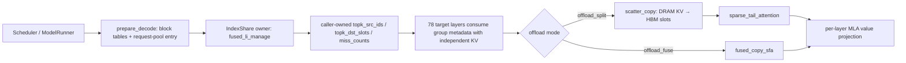
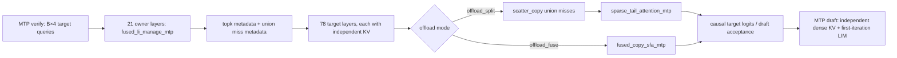

# nano-vLLM Ascend：GLM-5.1 / GLM-5.2 W4A8

本项目基于 [nanovllm](https://github.com/GeeeekExplorer/nano-vllm) 项目修改，在昇腾 Ascend910C 上支持了 decode DSA KVcache offloading (HBM 上只保留少部分 KVcache ，请求的全量 KVcache 卸载到DRAM，在decode过程中动态加载需要的KVcache) 。目前支持 GLM-5.1-w4a8 和 GLM-5.2-w4a8 模型。

运行时要求 BF16、Expert Parallel、128-token KV block，以及 ModelSlim 1.0.0 per-channel W4A8 checkpoint。Routed experts 保持原生 W4A8；Attention、dense/shared MLP 的 W8A8 权重在加载时反量化为 BF16。

`main-glm52` 支持 `GLM-5.2-w4a8` 在 20K～64K 范围内使用 `MTP0/MTP3 × none/offload_split/offload_fuse × eager/FULL_DECODE_ONLY`。MTP3 target verification 一次处理每请求四路因果 query；offload 路径使用对应的 `*_mtp` LIM 和 Attention 算子。

　

## 支持范围

### GLM-5.1 / GLM-5.2 MTP

`NANOVLLM_NUM_SPECULATIVE_TOKENS` 只接受 `0` 或 `3`。图模式只针对后续稳定 decode。Prefill、首次 decode、卸载缓存初始化和首次 lazy capture 允许走 eager；稳定且 batch size 与 capture size 完全一致后才 replay。

| MTP | `NANOVLLM_OFFLOAD_MODE` | eager | `FULL_DECODE_ONLY` | 稳定 decode 路径 |
| ---: | --- | :---: | :---: | --- |
| 0 | `none` | 支持 | 支持 | Dense MLA |
| 0 | `offload_split` | 支持 | 支持 | `fused_li_manage → scatter_copy → sparse_tail_attention` |
| 0 | `offload_fuse` | 支持 | 支持 | `fused_li_manage → fused_copy_sfa`，支持 bs>24 |
| 3 | `none` | 支持 | 支持 | MTP3 + Dense MLA |
| 3 | `offload_split` | 支持 | 支持 | `fused_li_manage_mtp → scatter_copy → sparse_tail_attention_mtp` |
| 3 | `offload_fuse` | 支持 | 支持 | `fused_li_manage_mtp → fused_copy_sfa_mtp`；后者内部按序执行 union SCATTER 与 MTP-SFA |

　

### DSA decode 卸载

设置 `NANOVLLM_OFFLOAD_MODE` 可以将 target layer 的历史 KV 从 HBM 卸载到 DRAM；`none` 保持 dense MLA，不使用 DRAM KV 池。卸载只覆盖稳定 decode，prefill 仍会写入完整 KV，首次需要卸载的 decode 会初始化 LIDU 缓存，因此不应将这些阶段纳入 TPOT 对比。

- `offload_split`：LIM 先根据 LightningIndexer 选出 top-2048 token，随后分别执行 DRAM→HBM `scatter_copy` 和 top-2048 + dense tail Attention。
- `offload_fuse`：在稳定 decode 将搬移与 Attention 合并为 `fused_copy_sfa` / `fused_copy_sfa_mtp`；首次 LIDU 初始化仍安全地走 split 路径。
- GLM-5.2 target layer 采用官方 IndexShare schedule：21 个 full layer 运行 LIM，57 个 shared layer 复用 owner 的 token/slot/miss 元数据；78 层仍分别使用自己的 KV payload 执行 Attention，绝不跨层复用 KV 或 Attention 输出。
- MTP3 的 target verification 每请求以四路因果 query 执行；MTP LIM 管理四路 top-2048 的并集，MTP Attention 仍为每个 query 使用其对应的因果可见 KV 长度。MTP draft layer 使用独立的 dense KV source，并在 draft iteration 间复用首次选择结果。

`offload_split` 与 `offload_fuse` 是等价的卸载编排，应该在相同请求和采样设置下输出一致。它们与 `none` 分别使用稀疏 top-2048 + dense-tail 和 dense MLA，长序列生成可能因稀疏近似出现分叉；验收应以任务质量、稳定性以及 split/fuse 一致性为准。

当前卸载配置要求 `NANOVLLM_KVCACHE_BLOCK_SIZE=128`、`kv_lora_rank=512`、`qk_rope_head_dim=64`、`index_topk=2048` 与 `index_n_heads/index_head_dim=32/128`。支持范围为常用 20K～64K 序列，不面向 1M 上下文。七个内置算子的接口与边界见 [`README_ops.md`](README_ops.md)。

#### 稳定 decode 调用图

MTP0 的 owner layer 运行 LIM；GLM-5.2 的 shared layer 只消费 owner 写入的选择元数据。每个 target layer 仍以自身 KV 执行后续算子。



MTP3 target verification 将每个请求的四个 target query 合为一次 `B×4` 前向。`fused_li_manage_mtp` 管理四路 top-2048 的并集，MTP Attention 则按 query row 应用因果 KV 可见长度。



#### 块与元数据管理

卸载以请求为单位分配 block table；所有物理池都由 `Scheduler` 的 `SimpleBlockManager` 管理，并保留一个 null block。`PoolEntryManager` 的容量等于最大 decode 并发数，因此 request-pool、LIDU 映射和可捕获 batch 的并发上界一致。

| 资源 | 请求侧引用 | 内容与用途 | 生命周期 |
| --- | --- | --- | --- |
| Target HBM KV | `hbm_block_table` | LIDU 选中的 `C` 个 slot、dense prefill tail 和后续 decode token | prefill 先完整写入；若 `C` 已覆盖完整 source 则保持驻留，否则完成后释放完整 prompt block、仅保留 tail，并在首次 decode 前回补 `C` 个 block |
| DRAM source KV | `dram_block_table` | 原始 prompt 的完整 block CKV/KPE，是 `scatter_copy` 的 source | 仅有 `C > 0` 的 offload 请求分配；请求结束、abort 或 preemption 时回收 |
| Index KV | `index_block_table` | LightningIndexer 的 index key cache，供 LIM 在完整 prompt block 上检索 | 只在 prefill 建立；decode 新生成 token 不会进入候选 source，也不会扩容该池 |
| LIDU 映射 | `offload_pool_entry` → `cache_slots_pool` | source token ID 到 HBM logical slot 的持久映射，以及 caller-owned LIM 输出 buffer | 每个请求一个 pool entry；GLM-5.2 的同一 IndexShare group 共享映射与选择元数据 |
| MTP dense KV | `mtp_block_table` | 递归 draft layer 的完整 dense HBM KV，和 target 稀疏 HBM 布局隔离 | 仅 MTP + offload 或 MTP iteration IndexShare 使用；与请求同时回收 |

对于需要 LIDU 的长请求，资源转移顺序如下：

1. `_allocate_prefill` 分配 HBM、Index、DRAM 和 request-pool entry；prefill 将 target KV 写入 HBM/DRAM，并建立 Index KV。
2. 当 `C` 小于完整 source 时，`finalize_prefill_offload` 将完整 prompt HBM block 标记为可释放项，只保留 dense tail；若 `C` 已覆盖 source，则保持原 HBM layout。可释放的 `C` 个 LIDU HBM block 在这段时间可以被后续 prefill 借用，但调度器会为每个活跃请求保留逻辑预算。
3. 首次 decode 前，`may_append` 原子地补回 `C` 个 HBM block；owner 通过 `initialize_lidu_row` 建立 source→slot 映射，shared layer 使用同一映射把自己的 KV 搬入对应 slot。该步骤保持 eager。
4. 后续稳定 decode 中，LIM 增量更新映射和 miss 元数据；split 路径显式搬移 miss，fuse 路径在融合算子内完成。生成 token 始终追加到 dense tail，不成为下一轮 LIM 的 source。
5. 正常结束、abort 和 preemption 均经 `deallocate` 回收四类 block table 与 pool entry；preemption 会重置 prefill 进度后重新进入等待队列。

`ModelRunner.prepare_decode` 会把 HBM/DRAM/Index block table、候选长度、LIDU 预算和 request-pool entry 打包到运行时 context。FULL_DECODE_ONLY 复用这些 caller-owned、固定地址的 metadata/output buffer；只有首次初始化完成且运行 batch 与 capture size 精确一致时，才进入稳定 graph replay。

### HBM缓存预算

修改 `nanovllm/engine/dsa_offload.py` 的 `LIDU_CACHE_TOKEN_BUDGETS` 可以修改缓存预算。默认如下：

| prompt 长度 | 不开MTP的缓存预算 (tokens) | 开MTP的缓存预算 (tokens) |
| :-: | :--: | :--: |
| `<= 2048` | 0 | 0 |
| `2049–8192` | 2048 | `floor(L / 128) × 128`，缓存全部 prefill 满块 |
| `8193–16384` | 6144 | 8192 |
| `16385–32768` | 6144 | 8192 |
| `32769–65536` | 8192 | 8192 |
| `>= 65537` | 12288 | 12288 |

　

## 编译算子

首次部署或修改 C++、host tiling、AscendC kernel 后必须重新编译：

```bash
export ASCEND_HOME_PATH=/usr/local/Ascend/cann-8.5.1
export CANN_INSTALL_PATH=/usr/local/Ascend/cann-8.5.1
PYTHONPATH=$PWD:$PYTHONPATH PYTHONUNBUFFERED=1 SOC_VERSION=ascend910_9391 NANOVLLM_CANN_BUILD_JOBS=64 NANOVLLM_EXT_BUILD_JOBS=1 bash scripts/build_nanovllm_ops.sh
```

算子接口、边界和昇腾 UT 命令见 [`README_ops.md`](README_ops.md)。

　

## 运行

先设置一些公共环境变量

```bash
export PYTHONUNBUFFERED=1
export PYTORCH_NPU_ALLOC_CONF=expandable_segments:True
export ASCEND_LAUNCH_BLOCKING=0
export ASCEND_RT_VISIBLE_DEVICES=0,1,2,3,4,5,6,7,8,9,10,11,12,13,14,15
export NANOVLLM_MODEL=/home/models/GLM-5.2-w4a8/  # set model path here, support GLM-5.1-w4a8 and GLM-5.2-w4a8 
export NANOVLLM_TP_SIZE=16
export NANOVLLM_ENFORCE_EAGER=0
export NANOVLLM_IGNORE_EOS=1
export NANOVLLM_MAX_STEPS=20
export NANOVLLM_PREFILL_CHUNK_SIZE=4096           # support 0 (no chunk prefill), 1024, 2048, 4096, 8192 
export NANOVLLM_NUM_SPECULATIVE_TOKENS=3          # set to 0 to disable MTP
```

运行 seqlen=64k，bs=5

```bash
PYTHONPATH=$PWD:$PYTHONPATH NANOVLLM_OFFLOAD_MODE=offload_fuse NANOVLLM_HBM_NUM_BLOCKS=600 NANOVLLM_DRAM_NUM_BLOCKS=2600 python3 example/test_dureader.py --prompt_len 65800 --prompt_count 5
```

运行 seqlen=64k，bs=15

```bash
PYTHONPATH=$PWD:$PYTHONPATH NANOVLLM_OFFLOAD_MODE=offload_fuse NANOVLLM_HBM_NUM_BLOCKS=1530 NANOVLLM_DRAM_NUM_BLOCKS=7900 python3 example/test_dureader.py --prompt_len 65800 --prompt_count 15
```

　

## 开profile运行 (导出后可用mindstudio查看)

只采集 TP rank 0、从首次 decode 到程序结束，加上 `NANOVLLM_PROFILE_DECODE_OUTPUT` 环境变量就行

```bash
NANOVLLM_PROFILE_DECODE_OUTPUT=./<profile输出路径>  <你要运行的命令>
```

　
