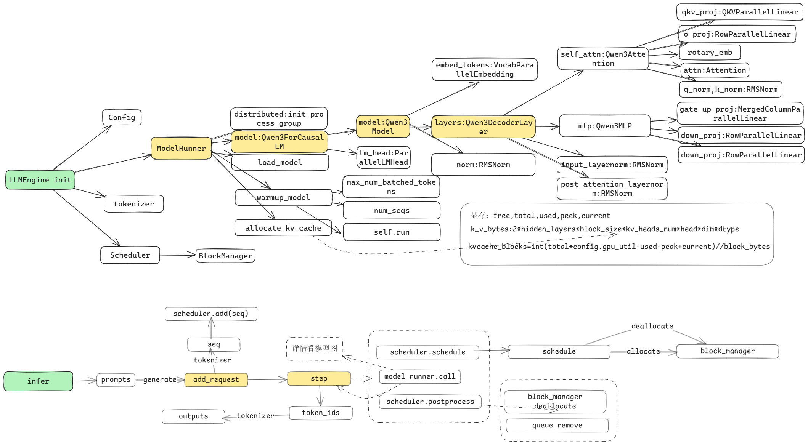
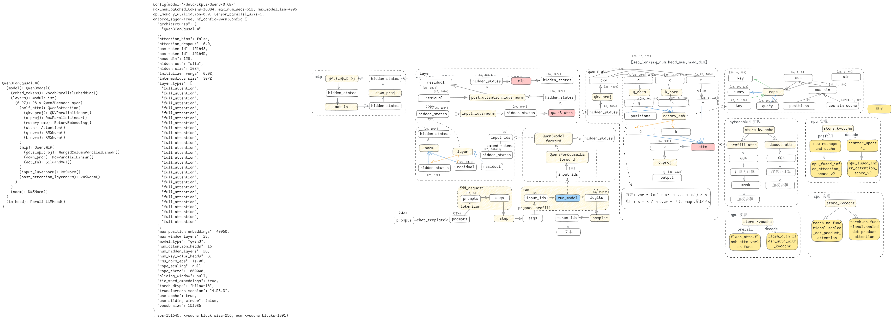
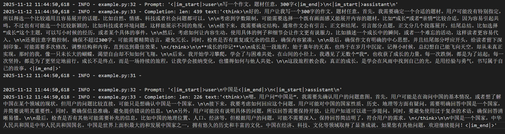

## Nano-vLLM-Ascend

nano-vllm是github开源的一个gpu推理项目，基于开源版本弄的一个ascend npu版本推理小demo，旨在帮助初学者了解推理的整体流程，区别于vllm，nano-vllm体量更小，麻雀虽小五脏俱全，更有助于初学者学习，非常适合用于相关概念的理解。

## 框架层流程图

## 模型层流程图


## 特性
* 📖 **可读代码库** - 核心约2428行Python代码的清晰实现
* ⚡ **优化套件** - 张量并行、torchair Ascend IR图编译和图缓存、融合算子、前缀缓存等
- [✅] 待完成：目前只支持单算子, npu图模式实现
- [✅] 支持CPU环境运行：[nano-vllm-cpu 代码仓库](https://github.com/linzm1007/nano-vllm-cpu)
- [✅] 性能优化
- [⏳] 支持模型: Qwen3-0.6B、Qwen3-32B、Qwen2-0.5B、Qwen2.5-0.5B、Qwen2.5-0.5B-Instruct、Llama-3.2-1B-Instruct、Qwen3-30B-A3B、Qwen3-VL-2B-Instruct、MiniCPM4-0.5B
- [✅] 支持一个moe模型:Qwen3-30B-A3B(暂时不支持入图)
- [📅] 支持一个omni模型
- [✅] 支持一个vl模型:Qwen3-VL-2B-Instruct(暂时不支持入图)
- [✅] 实现page attention
- [📅] 实现一个自定义算子
- [📅] 支持在线推理

torchair接口参考 https://www.hiascend.com/document/detail/zh/Pytorch/710/modthirdparty/torchairuseguide/torchair_00008.html
融合算子接口参考 https://www.hiascend.com/document/detail/zh/Pytorch/720/apiref/torchnpuCustomsapi/context/torch_npu-npu_fused_infer_attention_score_v2.md
attention实现参考 https://gitee.com/omniai/omniinfer/blob/master/omni/layers/attention/backend/attention.py  forward_vanilla函数

## 支持的模型
| 架构                   | 模型                    | 示例 HF 模型 |
|----------------------|-----------------------|----------|
| Qwen3ForCausalLM     | Qwen3-0.6B,Qwen3-32B  |          |
| Qwen2ForCausalLM     | Qwen2-0.5B            |          |
| LlamaForCausalLM     | Llama-3.2-1B-Instruct |          |
| Qwen3MoeForCausalLM  | Qwen3-30B-A3B         |          |
| Qwen3VLForConditionalGeneration | Qwen2.5-VL-3B-Instruct |          |
| MiniCPMForCausalLM   | MiniCPM4-0.5B         |          |

## 代码行数
📊 总体数据
| 范围 | 文件数 | 总行数 | 占比 |
|------|--------|--------|------|
| nanovllm 全部 | 20 个 | 4,652 行 | 100% |
| models 目录 | 5 个 | 2,224 行 | 47.8% |
| 除 models 外 | 15 个 | 2,428 行 | 52.2% |

## 推理优化技术大纲

📚 **完整技术文档**：[LLM 推理优化技术大纲](docs/inference_optimization_guide.md)

本文档整理了 LLM 推理领域的 **20 大类关键技术**，分为 7 个层次：

### 🔥 核心技术（基础必备）
- **KV Cache 管理**：PageAttention、Prefix Caching、KV Cache 压缩
- **Attention 优化**：FlashAttention、GQA/MQA、稀疏注意力
- **批处理策略**：Continuous Batching、Dynamic Batching

### 🚀 性能优化（进阶）
- **量化技术**：INT8/INT4/FP8、AWQ、GPTQ、GGUF
- **投机采样**：Speculative Decoding、Medusa、Lookahead
- **解码优化**：Parallel Decoding、Token Tree Verification

### 🏗️ 系统架构
- **调度策略**：FCFS、SJF、Priority-based、Preemption
- **内存优化**：Memory Pool、Swapping、Offloading
- **并行策略**：Tensor/Pipeline/Expert/Sequence Parallelism

### 🧠 特殊场景
- **长上下文**：RoPE Scaling、StreamingLLM、Ring Attention
- **多模态**：Vision-Language、Audio-Language、Unified Architecture
- **MoE 优化**：Expert Routing、Load Balancing、All-to-All 通信

### ⚡ 底层优化
- **图编译**：TorchAir、TensorRT-LLM、Torch.compile
- **算子融合**：QKV Fusion、Custom CUDA/Triton Kernels
- **通信优化**：NCCL/HCCL、RDMA、GPUDirect

### 📊 评估观测
- **性能分析**：Memory/Compute Profiling、Roofline Analysis
- **关键指标**：TTFT、TPOT、Throughput、GPU Utilization

### 🔮 前沿趋势
- **模型架构**：Mamba/RWKV、Mixture of Depths、RetNet
- **服务化**：Disaggregated Serving、Elastic Scaling
- **新兴方向**：推理蒸馏、Early Exit、Hardware-Aware NAS

---

## Attention

### PageAttention

**PageAttention** 是 vLLM 的核心创新技术，灵感来自操作系统的**虚拟内存分页机制**，用于高效管理 LLM 推理中的 KV Cache。

#### 核心概念

传统 KV Cache 分配方式会为每个序列预分配最大可能长度的连续内存，导致严重的内存浪费和碎片。PageAttention 借鉴操作系统分页思想，将 KV Cache 划分为固定大小的 block，按需动态分配。

#### 关键技术点

| 技术 | 说明 |
|------|------|
| **Block 管理** | 将 KV Cache 划分为固定大小的 block（如 16/32 tokens），每个 block 独立分配 |
| **Block Table** | 类似页表的数据结构，记录逻辑 token 位置到物理 block 的映射关系 |
| **非连续存储** | 同一序列的 KV Cache 可以分散在多个不连续的 block 中 |
| **内存共享** | 并行解码（如 beam search）时可共享 prompt 的 KV cache |
| **Copy-on-Write** | 写时复制机制，仅在需要修改时才复制 block |

#### 内存使用对比

```
传统方式：
- 序列长度 1000，最大支持 4096
- 内存占用：4096 * hidden_size 
- 浪费率：约 75%

PageAttention：
- 序列长度 1000，block_size=16
- 需要 block：1000/16 = 63 个
- 实际分配：63 * 16 = 1008 tokens
- 浪费率：仅 0.8%
```

#### 代码实现

```python
# nanovllm/layers/attention.py
# Block Table 映射
block_table = context.block_tables  # 映射表

# Slot Mapping - 将 token 映射到 block 中的具体位置
# slot_mapping 格式：[block_idx, offset_in_block]
context.slot_mapping

# 分页存储 KV Cache
torch_npu._npu_reshape_and_cache(
    k, v,
    k_cache.view(num_blocks, block_size, num_kv_heads, head_dim),
    v_cache.view(num_blocks, block_size, num_kv_heads, head_dim),
    slot_mapping.int()
)
```

#### 优势

1. **内存效率**：按需分配，无内部碎片
2. **动态扩展**：序列增长时只需分配新 block
3. **内存共享**：多个序列可共享相同的 prompt KV Cache
4. **高吞吐量**：支持更大的 batch size

#### 详细对比

📄 **详细技术文档**：[HuggingFace Transformers 早期实现与 PageAttention 对比](docs/pageattention_comparison.md)

包含：
- 早期 Transformers 代码实现分析
- 内存浪费的量化对比（75% vs 6.25%）
- 不同 batch size 和序列长度的详细对比表
- vLLM 论文数据来源说明
- 实际代码示例和场景分析

---

### FlashAttention

**FlashAttention** 是斯坦福大学提出的 **IO 感知** 注意力优化算法，通过分块计算和减少 HBM（高带宽内存）访问来提升性能。

#### 核心问题

标准 Attention 实现需要存储中间结果（注意力矩阵）到 HBM，导致：
- **内存瓶颈**：HBM 带宽远低于计算速度
- **O(N²) 内存**：序列长度的平方级内存增长
- **多次数据搬运**：Q、K、V 需要多次读写 HBM

#### 核心创新

| 技术 | 原理 | 效果 |
|------|------|------|
| **Tiling（分块）** | 将 Q、K、V 分块加载到高速 SRAM | 减少 HBM 访问次数 |
| **Online Softmax** | 流式计算 softmax，无需完整注意力矩阵 | 内存降至 O(N) |
| **Recomputation** | 反向传播时重新计算中间值 | 牺牲计算换内存 |
| **Kernel Fusion** | 多个操作融合为单个 CUDA kernel | 减少 kernel 启动开销 |

#### 内存层次结构对比

```
GPU 内存层次：
┌─────────────────────────────────────┐
│  HBM (High Bandwidth Memory)        │  ← 1.5 TB/s，容量大但速度慢
│  - 容量：40-80 GB                   │  ← 标准 Attention 在此频繁读写
│  - 延迟：高                         │
├─────────────────────────────────────┤
│  SRAM (Static RAM / Shared Memory)  │  ← 19 TB/s，容量小但速度快
│  - 容量：~100 KB per SM             │  ← FlashAttention 主要在此计算
│  - 延迟：极低                       │
└─────────────────────────────────────┘
```

#### 计算流程对比

**标准 Attention：**
```
1. 从 HBM 加载 Q, K, V
2. 计算 S = QK^T → 写入 HBM
3. 计算 P = softmax(S) → 写入 HBM  
4. 计算 O = PV → 写入 HBM
❌ 多次 HBM 读写，内存占用 O(N²)
```

**FlashAttention：**
```
1. 分块加载 Qᵢ, Kⱼ, Vⱼ 到 SRAM
2. 在 SRAM 中计算 softmax
3. 累加结果到输出
4. 丢弃中间结果，重复直到完成
✅ 仅需 O(N) 内存，大幅减少 HBM 访问
```

#### 代码实现

```python
# nanovllm/layers/attention_ori.py
from flash_attn import (
    flash_attn_varlen_func,      # Prefill 阶段
    flash_attn_with_kvcache      # Decode 阶段
)

# Prefill - 处理变长序列，支持 PageAttention
flash_attn_varlen_func(
    q, k, v,
    max_seqlen_q=max_seqlen_q,
    cu_seqlens_q=cu_seqlens_q,    # 累计长度支持变长
    causal=True,                  # 因果掩码
    block_table=block_table       # PageAttention block table
)

# Decode - 单 token 推理，复用分页 KV Cache
flash_attn_with_kvcache(
    q.unsqueeze(1),               # [batch, 1, num_heads, head_dim]
    k_cache, v_cache,             # 分页 KV 缓存
    cache_seqlens=context_lens,   # 实际序列长度
    block_table=block_table       # block table 映射
)
```

#### 性能收益

- **内存效率**：从 O(N²) 降至 O(N)
- **计算速度**：A100 上可达 **2-4 倍**加速
- **序列长度**：支持更长的上下文（如 100K+ tokens）

---

### 三种 Attention 实现对比

本项目包含三种 Attention 实现，适用于不同场景：

| 特性 | attention_ori.py | attention.py | attention_torch_native.py |
|------|-----------------|--------------|--------------------------|
| **底层实现** | Flash Attention 库 | NPU 原生算子 | PyTorch 原生 |
| **适用平台** | CUDA GPU | 华为昇腾 NPU | 通用（CPU/GPU）|
| **性能** | ⭐⭐⭐⭐⭐ | ⭐⭐⭐⭐⭐ | ⭐⭐ |
| **可读性** | ⭐⭐ | ⭐⭐ | ⭐⭐⭐⭐⭐ |
| **用途** | 生产环境（GPU）| 生产环境（NPU）| 学习调试 |

**选择建议：**
- **生产环境（GPU）**：使用 `attention_ori.py`（Flash Attention）
- **生产环境（昇腾 NPU）**：使用 `attention.py`（NPU 算子）
- **学习/调试**：使用 `attention_torch_native.py`（易于理解）

## 文档索引

本目录包含项目各模块的详细流程图文档，使用 Mermaid 语法绘制。

### Engine 模块流程图

| 文档 | 描述 |
|------|------|
| [docs/engine/sequence_flowchart.md](docs/engine/sequence_flowchart.md) | Sequence 序列状态管理流程 |
| [docs/engine/block_manager_flowchart.md](docs/engine/block_manager_flowchart.md) | BlockManager KV缓存块管理流程 |
| [docs/engine/scheduler_flowchart.md](docs/engine/scheduler_flowchart.md) | Scheduler 调度器流程 |
| [docs/engine/model_runner_flowchart.md](docs/engine/model_runner_flowchart.md) | ModelRunner 模型运行器流程 |
| [docs/engine/llm_engine_flowchart.md](docs/engine/llm_engine_flowchart.md) | LLMEngine 主引擎流程 |

### Layers 模块流程图

| 文档 | 描述 |
|------|------|
| [docs/layers/linear_flowchart.md](docs/layers/linear_flowchart.md) | 线性层与张量并行策略 |
| [docs/layers/attention_torch_native_flowchart.md](docs/layers/attention_torch_native_flowchart.md) | PyTorch原生Attention实现 |
| [docs/layers/attention_flowchart.md](docs/layers/attention_flowchart.md) | NPU专用Attention实现 |
| [docs/layers/attention_ori_flowchart.md](docs/layers/attention_ori_flowchart.md) | Flash Attention优化实现 |
| [docs/layers/sampler_flowchart.md](docs/layers/sampler_flowchart.md) | 采样器（温度采样） |
| [docs/layers/rotary_embedding_flowchart.md](docs/layers/rotary_embedding_flowchart.md) | RoPE位置编码 |
| [docs/layers/layernorm_flowchart.md](docs/layers/layernorm_flowchart.md) | RMSNorm归一化层 |
| [docs/layers/embed_head_flowchart.md](docs/layers/embed_head_flowchart.md) | 词嵌入与LM Head |
| [docs/layers/activation_flowchart.md](docs/layers/activation_flowchart.md) | SwiGLU激活函数 |

### Models 模块流程图

| 文档 | 描述 |
|------|------|
| [docs/models/llama_flowchart.md](docs/models/llama_flowchart.md) | Llama模型架构 |
| [docs/models/qwen3_flowchart.md](docs/models/qwen3_flowchart.md) | Qwen3模型架构 |
| [docs/models/qwen3_vl_flowchart.md](docs/models/qwen3_vl_flowchart.md) | Qwen3-VL多模态模型架构 |
| [docs/models/qwen3_moe_flowchart.md](docs/models/qwen3_moe_flowchart.md) | Qwen3-MoE稀疏专家模型架构 |
| [docs/models/mini_cpm4_flowchart.md](docs/models/mini_cpm4_flowchart.md) | MiniCPM4模型架构 |
| [docs/models/models_map_flowchart.md](docs/models/models_map_flowchart.md) | 模型注册映射关系 |

---
## bench数据
仅供参考，硬软条件不同，跑出的数据也会有差异
#### 不同模型对比
| model                 | Output Tokens | Time (s) | Throughput (tokens/s) | TP |
|-----------------------|---------------|----------|-----------------------|----|
| Qwen3-0.6B            | 143,770       | 36.82    | 3904.20               | 1  |
| Qwen2-0.5B            | 143,770       | 20.71    | 6940.84               | 1  |
| Qwen2.5-0.5B-Instruct | 143,770       | 19.82    | 7252.67               | 1  |
| Llama-3.2-1B-Instruct | 143,770       | 25.45    | 5648.50               | 1  |
| Qwen3-32B             | 143,770       | 206.69   | 695.59               | 2  |
| Qwen3-32B             | 143,770       | 119.86   | 1199.50               | 4  |


#### 其他框架对比(2025-12-30)
vLLM Nano-vLLM 数据来源 https://github.com/GeeeekExplorer/nano-vllm

| Inference Engine                  | Output Tokens | Time (s) | Throughput (tokens/s) |
|-----------------------------------|-------------|----------|-----------------------|
| vLLM                              | 133,966     | 98.37    | 1361.84               |
| Nano-vLLM                         | 133,966     | 93.41    | 1434.13               |
| Nano-vLLM-Ascend python torch原生实现 | 4805     | 257.49    | 18.66               | 
| Nano-vLLM-Ascend 融合算子+图编译bs=256   | 133,966  | 33.88    | 3954.20               |

#### 图模式不同bs对比(2025-12-30)

| Batch Size | Output Tokens | Time (s) | Throughput (tokens/s) |
|------------|---------------|----------|-----------------------|
| bs=16      | 133,966       | 107.23   | 1249.37               |
| bs=32      | 133,966       | 75.89    | 1765.35               |
| bs=48      | 133,966       | 64.84    | 2066.22               |
| bs=64      | 133,966       | 54.06    | 2478.31               |
| bs=128     | 133,966       | 43.08    | 3109.56               |
| bs=256     | 133,966       | 33.88    | 3954.20               |

#### 单算子Padding和Non-padding对比(2025-12-30)
bs=256

| Prepare Strategy | Output Tokens | Time (s) | Throughput (tokens/s) |
|------------------|---------------|----------|-----------------------|
| Padding          | 133,966       | 158.46   | 845.41                |
| Non-padding      | 133,966       | 152.14   | 880.55                |

## 环境搭建（参考vllm-ascend）
https://docs.vllm.ai/projects/vllm-ascend-cn/zh-cn/latest/quick_start.html

ubuntu
```
# Update DEVICE according to your device (/dev/davinci[0-7])
export DEVICE=/dev/davinci0
# Update the vllm-ascend image
# Atlas A2:
# export IMAGE=quay.io/ascend/vllm-ascend:v0.14.0rc1
# Atlas A3:
# export IMAGE=quay.io/ascend/vllm-ascend:v0.14.0rc1-a3
export IMAGE=quay.io/ascend/vllm-ascend:v0.14.0rc1
docker run --rm \
--name vllm-ascend \
--shm-size=1g \
--device $DEVICE \
--device /dev/davinci_manager \
--device /dev/devmm_svm \
--device /dev/hisi_hdc \
-v /usr/local/dcmi:/usr/local/dcmi \
-v /usr/local/bin/npu-smi:/usr/local/bin/npu-smi \
-v /usr/local/Ascend/driver/lib64/:/usr/local/Ascend/driver/lib64/ \
-v /usr/local/Ascend/driver/version.info:/usr/local/Ascend/driver/version.info \
-v /etc/ascend_install.info:/etc/ascend_install.info \
-v /root/.cache:/root/.cache \
-p 8000:8000 \
-it $IMAGE bash
# Install curl
apt-get update -y && apt-get install -y curl
```

## 安装依赖
```bash
pip install .
```

## 模型下载

```bash
huggingface-cli download --resume-download Qwen/Qwen3-0.6B \
  --local-dir ~/huggingface/Qwen3-0.6B/ \
  --local-dir-use-symlinks False
```

## 快速开始

请参见 test.py 了解用法。该 API 与 vLLM 的接口基本一致，仅在 LLM.generate 方法上存在一些细微差异：
```python
from nanovllm import LLM, SamplingParams
llm = LLM("/YOUR/MODEL/PATH", enforce_eager=True, tensor_parallel_size=1)
sampling_params = SamplingParams(temperature=0.6, max_tokens=256)
prompts = ["Hello, Nano-vLLM."]
outputs = llm.generate(prompts, sampling_params)
outputs[0]["text"]
```

## example运行结果


## bench环境
仅供参考
ascend-dmi -c #查看
* 硬件环境​：
  * 1.显卡:A3 910C
  * 2.驱动版本:24.1.rc3.10
  * 3.固件版本:7.5.0.109.220
* ​软件环境​：
  * 1.CANN包 8.3.RC1
  * 2.PTA版本：torch-npu 2.5.1.post2+gitd7a85f8，torch 2.5.1

## Benchmark

See `bench.py` for benchmark.

**Test Configuration:**
- Model: Qwen3-0.6B
- Total Requests: 256 sequences
- Input Length: Randomly sampled between 100–1024 tokens
- Output Length: Randomly sampled between 100–1024 tokens

**Performance Results:**
Nano-vLLM-Ascend 实在太慢了只跑了10条seq

| Inference Engine | Output Tokens | Time (s) | Throughput (tokens/s) |
|----------------|-------------|----------|-----------------------|
| vLLM           | 133,966     | 98.37    | 1361.84               |
| Nano-vLLM      | 133,966     | 93.41    | 1434.13               |
| Nano-vLLM-Ascend| 4805     | 257.49    | 18.66               |


## qwen3-0.6B layers
```angular2html
ModuleList(
  (0-27): 28 x Qwen3DecoderLayer(
    (self_attn): Qwen3Attention(
      (qkv_proj): QKVParallelLinear()
      (o_proj): RowParallelLinear()
      (rotary_emb): RotaryEmbedding()
      (attn): Attention()
      (q_norm): RMSNorm()
      (k_norm): RMSNorm()
    )
    (mlp): Qwen3MLP(
      (gate_up_proj): MergedColumnParallelLinear()
      (down_proj): RowParallelLinear()
      (act_fn): SiluAndMul()
    )
    (input_layernorm): RMSNorm()
    (post_attention_layernorm): RMSNorm()
  )
)

```
